# DetourTO — Stage 1 Project Design Report

### A disruption-aware TTC trip planning agent

**Course:** EECS 3311 Software Design, York University, Fall 2026
**Author:** Pratham Patel (219467315)
**Stage:** 1 — Software and Agent Design
**Repository:** this repository (the same one will be used for Stages 2 and 3)

---

## Contents

1. [Project Overview](#1-project-overview)
2. [Feature Specifications](#2-feature-specifications)
3. [UML Class Diagram](#3-uml-class-diagram)
4. [Design Patterns](#4-design-patterns)
5. [Use Case Diagram](#5-use-case-diagram)
6. [Use Case Descriptions](#6-use-case-descriptions)
7. [Sequence Diagrams](#7-sequence-diagrams)
8. [Feature-to-Design Traceability Table](#8-feature-to-design-traceability-table)
9. [Feature Implementation Explanations](#9-feature-implementation-explanations)
10. [Appendices](#10-appendices)

---

# 1. Project Overview

## 1.1 Problem and Motivation

Toronto transit riders deal with disruptions all the time: a subway closure between two stations, a streetcar diversion, a bus stuck in traffic, an elevator out of service at the one station a wheelchair user needs. The TTC publishes this information, but it is scattered:

- **Subway disruptions arrive as free text.** An alert like *"No subway service between St George and Union due to track work. Shuttle buses operating."* has to be read and understood by a person. There is no machine-readable list of closed stops for the subway, and the TTC does not publish subway real-time vehicle data at all.
- **Bus and streetcar data is machine-readable but raw.** The GTFS-Realtime feed gives delays per trip and vehicle positions, but it says nothing about what those delays mean for *your* trip.
- **Journey planners and alerts live in separate places.** A general map app will route you onto a closed line if it has not picked up the alert, and it will not explain why one detour is better than another for your constraints (arrive by 10:00, no stairs, avoid a crowded route).

So when something goes wrong, the rider has to read alerts, work out which of their legs are affected, re-plan by hand, and decide between options while standing on a platform.

**DetourTO** is a desktop application (JavaFX GUI plus a command-line interface) that combines a deterministic journey planner over the TTC's published schedule with an LLM agent that reads alerts, understands natural-language requests, re-plans around disruptions, explains trade-offs, and keeps watching an active trip.

## 1.2 Target Users

| User | Need |
|---|---|
| Daily commuters (students, workers) | Know before leaving home if the usual route is broken, and what to do instead |
| Riders who need step-free access | Routes that avoid stations without elevators, and early warning of elevator outages |
| Occasional riders and visitors | Plan in plain English ("get me to the ROM from Union") without knowing route numbers |
| Evaluators (TA, developers) | Replay a recorded disruption and measure how well the agent handled it |

## 1.3 What the Agent Does

The agent is not a chatbot that answers transit questions from memory. It works through tools over real data and every answer is checked by deterministic code before the rider sees it:

1. **Understands requests.** Turns "York U by 10, no streetcars, I use a wheelchair" into a structured `TripQuery` (origin, destination, arrive-by time, avoided modes, step-free requirement). If a place is ambiguous it asks a clarifying question instead of guessing.
2. **Uses tools.** It can call `find_stop`, `plan_journey`, `get_alerts`, `get_arrivals` and `get_profile`. The tools run deterministic Java code; the LLM only decides which tool to call and with which arguments.
3. **Interprets alerts.** Converts free-text service alerts into structured `Disruption` objects (affected routes, closed stop ids, time window, kind). Every stop id it produces is checked against the real network.
4. **Re-plans.** Applies disruptions to the network and asks the planner for new itineraries, then explains the options using only the numbers the planner computed.
5. **Remembers.** Keeps saved places ("home", "school") and learned preferences ("avoid the 29") in a rider profile, and keeps the conversation so follow-ups like "what if I leave 15 minutes later?" work.
6. **Monitors.** While a trip is active it polls the real-time feed and alerts, moves the trip through states (on track, at risk, rerouted, completed), and proposes a reroute when the trip is at risk.

## 1.4 Why an Agent Is Appropriate

A traditional program handles the structured part well (shortest paths over a timetable), but three parts of this problem need language understanding and judgement:

- **Reading free-text alerts.** Subway alerts name stations in varied wording ("between St George and Union", "Bloor-Yonge to Eglinton", "at Spadina"). Mapping that onto stop ids is a language task.
- **Understanding requests and follow-ups.** Riders describe trips and constraints in natural language, refer to earlier turns ("the second one", "leave later"), and state preferences in passing.
- **Explaining trade-offs.** "Option B is 6 minutes slower but avoids the transfer at Bloor-Yonge, which is crowded at 8:30" is more useful than a table, and it has to be tailored to what the rider said they care about.

At the same time, the parts that must be correct (times, routes, stop ids, feasibility) stay deterministic. The design deliberately **lets the LLM propose and the Java code verify**: the `GroundingValidator` rejects any stop, route, itinerary id or minute value that the planner did not produce. This split is also what makes the system testable in Stage 3: JUnit covers the deterministic core, and KUMA probes the agent's behaviour.

## 1.5 AI Model and Integration

| Item | Choice |
|---|---|
| Provider | Amazon Bedrock, called directly through the AWS SDK for Java v2 (`bedrockruntime`, Converse API). No LangChain4j: the agent loop is our own code so it is visible in the class and sequence diagrams. |
| Models | Anthropic Claude on Bedrock. A Sonnet-class model for trip requests and explanations; a smaller Haiku-class model for alert interpretation and preference extraction (cheaper, called more often). The exact model ids are read from `AppConfig` because Bedrock model versions change over the term. |
| Credits | AWS new-account credits (Free Tier credit programme, Paid Plan). Azure for Students subscriptions cannot currently deploy Azure OpenAI models, so Azure is not used. |
| Tool use | Native Converse tool calling (`toolConfig`). Each `Tool` publishes a `ToolSpec` (name, description, JSON input schema). |
| Offline / test mode | `ScriptedLLMClient` returns scripted `LLMResponse`s so JUnit tests and some KUMA fault-injection cases run without network access or cost. |

**How the model interacts with the rest of the system.** No part of the software talks to Bedrock except `BedrockClaudeAdapter`, which implements the `LLMClient` interface. Agents (`TransitAgent` subclasses) run a fixed loop defined in `TransitAgent.run()`:

```
buildMessages(req)                              ← system prompt + context + conversation
repeat up to maxToolRounds:
    response = llm.complete(messages, toolSpecs, systemPrompt())
    if response has tool calls:
        results = toolRegistry.execute(call, ctx) for each call   ← deterministic Java
        append results to messages
    else break
output = parseFinal(response, ctx)               ← ResponseParser, JSON → domain object
report = validate(output, ctx)                   ← GroundingValidator
return report.valid ? success(output) : onInvalid(report, req)   ← one repair retry, then fail safely
```

Every step publishes an `AGENT_STEP` event; `TraceLogger` writes these to `trace.jsonl`, which Stage 3's KUMA harness reads as evidence.

## 1.6 Overall Architecture

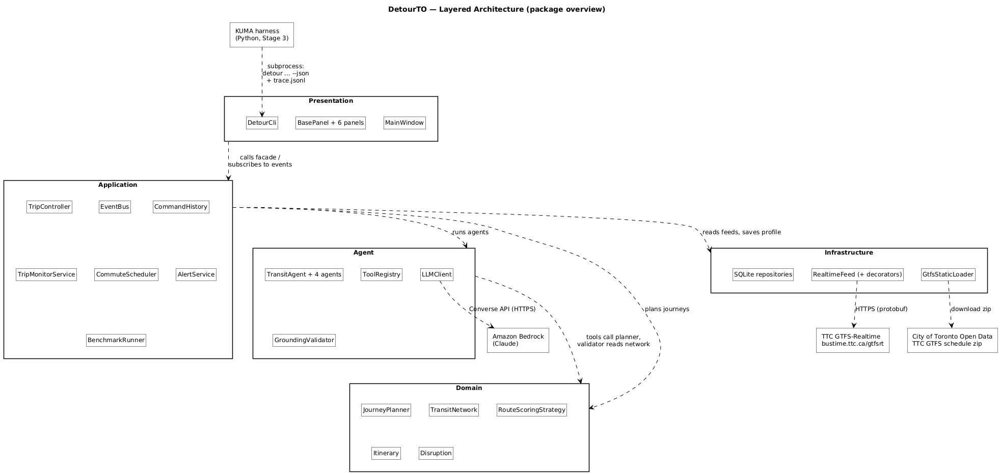

| Layer | Responsibility | Main classes |
|---|---|---|
| Presentation | JavaFX GUI (6 panels) and picocli CLI. No business logic. | `MainWindow`, `BasePanel` and subclasses, `DetourCli`, `ConsoleNotifier`, `JsonResultWriter` |
| Application | One facade for both interfaces, events, undoable query edits, trip monitoring, commute scheduling, alert handling, benchmarking | `TripController`, `EventBus`, `CommandHistory`, `TripMonitorService`, `ActiveTrip`, `CommuteScheduler`, `AlertService`, `BenchmarkRunner` |
| Agent | LLM agents, tool registry and tools, LLM adapter, parsing and grounding validation | `TransitAgent` + 4 agents, `ToolRegistry`, 5 tools, `LLMClient`, `BedrockClaudeAdapter`, `ResponseParser`, `GroundingValidator` |
| Domain | Transit network, RAPTOR journey planner, route strategies, itineraries, disruptions, rider profile | `TransitNetwork`, `NetworkView`, `JourneyPlanner`, `RouteScoringStrategy` + 4, `Itinerary`, `Leg`, `Disruption`, `PlaceResolver` |
| Infrastructure | Real-time feed adapter and decorators, static GTFS loading, SQLite repositories, configuration | `RealtimeFeed`, `GtfsRealtimeAdapter`, `CachingRealtimeFeed`, `ResilientRealtimeFeed`, `GtfsStaticLoader`, `Sqlite*Repository`, `AppConfig` |

Both the GUI and the CLI call the same `TripController` methods, so every feature is available from both. Agent calls take seconds, so the GUI runs controller calls on a background task and panels update through `BasePanel.runOnFxThread()` when events arrive; the CLI calls the same methods and blocks.

## 1.7 Technology

| Concern | Choice |
|---|---|
| Language / build | Java 21, Maven |
| GUI | JavaFX 21; map drawn in a `WebView` with Leaflet and OpenStreetMap tiles |
| CLI | picocli, command name `detour`; every command supports `--json` |
| LLM | AWS SDK for Java v2, Bedrock Runtime Converse API |
| Static transit data | TTC GTFS schedule from the City of Toronto Open Data portal ("TTC Routes and Schedules"), parsed by our own `GtfsStaticLoader` |
| Real-time data | TTC GTFS-Realtime (`https://bustime.ttc.ca/gtfsrt/alerts`, `/trips`, `/vehicles`), parsed with `gtfs-realtime-bindings` |
| Routing | Our own RAPTOR implementation (round-based public transit routing) in `JourneyPlanner` |
| Storage | SQLite (`sqlite-jdbc`) behind repository interfaces |
| JSON | Jackson |
| Unit tests (Stage 3A) | JUnit 5, Mockito, AssertJ |
| Agent tests (Stage 3B) | KUMA (Python SDK) driving `detour ... --json` as a subprocess and reading `trace.jsonl` |

## 1.8 Data Sources and Licence

Both TTC feeds are published under the Open Government Licence – Toronto, which allows reuse with attribution. The app shows *"Contains information licensed under the Open Government Licence – Toronto"* in its About panel and README. No API key is needed for either feed.

## 1.9 Scope and Known Limitations

- **Subway real-time.** The TTC publishes real-time predictions for buses and streetcars only. For subway legs DetourTO uses the schedule plus alerts, and says so in the UI.
- **Places.** Origins and destinations are resolved against stop and station names plus the rider's saved places. Street-address geocoding is a stretch goal (a `GeocodingService` adapter could be added behind `PlaceResolver` later).
- **Advice, not guarantees.** Alert interpretation can be wrong. Each LLM-derived disruption carries a confidence value and the original alert text is always shown next to it.

---
# 2. Feature Specifications

DetourTO has **13 features**. F01–F12 are the core agent and rider features; F13 (data refresh) is a supporting feature that keeps the data correct. None of them is a login, settings or "about" style operation.

Type legend: **D** = deterministic, **AI** = decided by the LLM (always validated), **H** = hybrid.

| ID | Feature | Type | GUI location | CLI command |
|---|---|---|---|---|
| F01 | Natural-language trip request | H | Trip Planner chat box | `detour plan "<request>"` |
| F02 | Multi-option journey planning | D | Trip Planner form and option list | `detour plan --from --to --arrive-by` |
| F03 | Route preference strategies | D | Trip Planner strategy box | `--strategy fastest\|fewest-transfers\|least-walking\|accessible` |
| F04 | Service alert interpretation | H | Alerts panel | `detour alerts` |
| F05 | Disruption-aware re-routing | H | Alerts panel "Re-route", trip-at-risk prompt | `detour plan ... --avoid-disruption <id>` |
| F06 | Grounded itinerary explanation and comparison | AI | Trip Planner "Explain" button | `detour plan ... --explain` |
| F07 | Live trip monitoring | H | Trip Planner "Start trip", status bar | `detour monitor <itineraryId>` |
| F08 | Stop arrivals board | D | Arrivals panel | `detour arrivals "<stop>"` |
| F09 | Saved places and preference memory | H | Commute panel, chat | `detour places add school "York University"` |
| F10 | Conversational what-if follow-ups with undo/redo | H | Trip Planner chat, Undo/Redo buttons | `detour plan ... --then "leave 15 min later"` |
| F11 | Commute watch and leave-by alerts | H | Commute panel | `detour commute add\|list\|remove` |
| F12 | Disruption replay and benchmark | H | Benchmark panel | `detour replay <scenario.json>` |
| F13 | Transit data refresh and validation | D | Benchmark panel "Refresh data" | `detour refresh-data` |

---

### F01 — Natural-Language Trip Request

- **Description:** The rider types a trip in plain English. The agent extracts origin, destination, time constraint, avoided routes or modes and accessibility needs, resolves place names to real stops using tools, and produces a validated `TripQuery`. Itineraries are then computed deterministically (F02).
- **User interaction (GUI):** Type into the Trip Planner chat box and press Send. Clarifying questions appear as chat bubbles with clickable stop candidates.
- **Input:** Free text, current time, rider profile (saved places, default strategy, avoided routes), conversation history.
- **Output:** `TripQuery`, or a `ClarificationRequest` with candidate stops; then a list of `Itinerary` options.
- **AI involvement:** Hybrid. The LLM interprets the text and chooses tool calls; place resolution, validation and planning are deterministic.
- **Expected workflow:** `TripPlannerPanel.onSendClicked()` → `TripController.planFromText()` → `TripRequestAgent.run()` (tool loop with `find_stop`, optionally `plan_journey` to check feasibility) → `ResponseParser.toTripQuery()` → `GroundingValidator.validateQuery()` → `JourneyPlanner.plan()` → options shown on list and map.
- **Error / alternative cases:** Ambiguous place → clarification question (UC17). Unknown place → "I couldn't find a stop called X" and the form is suggested. LLM returns malformed JSON → one repair retry with the parse error, then failure message. Bedrock timeout or throttling → error shown; the form (F02) still works without the LLM.

### F02 — Multi-Option Journey Planning

- **Description:** Computes several good itineraries between two stops using RAPTOR over the TTC GTFS schedule, with walking transfers between nearby stops, respecting depart-at or arrive-by constraints and active disruptions.
- **User interaction (GUI):** Trip Planner form: origin, destination, depart-at or arrive-by, then Plan. Options appear as cards (duration, transfers, walking metres, routes) and on the map.
- **Input:** `TripQuery`, current `Disruption` list, selected `RouteScoringStrategy`.
- **Output:** Up to 5 `Itinerary` objects, each made of `RideLeg` and `WalkLeg` legs, sorted by strategy score.
- **AI involvement:** Deterministic.
- **Expected workflow:** `TripController.planFromForm()` → `AlertService.currentDisruptions()` → `JourneyPlanner.plan()` → `TransitNetwork.withDisruptions()` creates a `NetworkView` → RAPTOR rounds → `reconstruct()` → strategy `score()` → sorted list.
- **Error / alternative cases:** Origin equals destination → validation message. No service at that time (e.g. 3 a.m. outside night routes) → "no route found", suggest a later time. Every path blocked by disruptions → "no route avoids the closure" plus the nearest shuttle stop if the alert mentions one.

### F03 — Route Preference Strategies

- **Description:** The rider chooses how routes are ranked and filtered: fastest, fewest transfers, least walking, or accessible (step-free). The accessible strategy rejects legs that board or alight at stations without step-free access or with a current elevator outage.
- **User interaction (GUI):** Strategy drop-down in the Trip Planner. The default comes from the rider profile.
- **Input:** `StrategyKind`, itineraries or candidate legs, `NetworkView` (for step-free and outage checks).
- **Output:** Filtered and re-ordered itineraries.
- **AI involvement:** Deterministic.
- **Expected workflow:** `onStrategyChanged()` → `TripController.setStrategy()` (recorded as a `ChangeStrategyCommand`, so it can be undone) → `JourneyPlanner.plan()` with the new strategy.
- **Error / alternative cases:** Accessible strategy finds no route → message lists which stations lack step-free access and suggests the nearest alternative.

### F04 — Service Alert Interpretation

- **Description:** Fetches TTC alerts, turns each into a structured `Disruption`, and shows them in plain language. Alerts that already name routes and stops in structured fields are converted deterministically; free-text alerts (typical for the subway) are interpreted by `AlertInterpreterAgent` and validated against the network.
- **User interaction (GUI):** Alerts panel with a table (summary, affected lines and stops, time window, confidence, original text) and a Refresh button.
- **Input:** GTFS-Realtime alerts feed, `TransitNetwork`.
- **Output:** List of `Disruption` (kind: closure, delay, detour, elevator outage, unknown).
- **AI involvement:** Hybrid.
- **Expected workflow:** `AlertsPanel.onRefreshClicked()` → `TripController.getAlerts()` → `AlertService.currentDisruptions()` → decorated feed (`CachingRealtimeFeed` → `ResilientRealtimeFeed` → `GtfsRealtimeAdapter`) → for new alerts: `fromStructuredFields()` or `AlertInterpreterAgent.run()` → `GroundingValidator.validateDisruption()` → `EventBus.publish(ALERTS_UPDATED)`.
- **Error / alternative cases:** Feed down → circuit breaker opens and the last good alerts are shown with a "stale" banner. LLM names a station that does not exist → disruption kept as `UNKNOWN` with confidence 0 and original text shown. Duplicate alerts → cached by alert id and interpreted once.

### F05 — Disruption-Aware Re-routing

- **Description:** Re-plans the current trip around one or more disruptions by closing the affected stops and routes in a `NetworkView`, then presents new options with an explanation (F06).
- **User interaction (GUI):** "Re-route" button on an alert row, or "Re-route?" prompt when an active trip is at risk (F07).
- **Input:** Current `TripQuery`, selected `Disruption`, other active disruptions.
- **Output:** New itineraries, the disruptions that were applied, and an explanation.
- **AI involvement:** Hybrid (planning deterministic, explanation AI).
- **Expected workflow:** `AlertsPanel.onRerouteClicked(d)` → `TripController.rerouteAround(d)` → `JourneyPlanner.plan(q, ds + d, s)` → `ExplanationAgent.run()` → `publish(ITINERARY_UPDATED)` → `MapPanel` redraws and highlights the closure.
- **Error / alternative cases:** No current trip → the rider is asked where they are going (F01). No feasible route → message plus shuttle information if present in the alert. Low-confidence disruption → the rider is told the closure was inferred and can choose to plan without it.

### F06 — Grounded Itinerary Explanation and Comparison

- **Description:** Compares the current options in plain language (time, transfers, walking, crowding hints from the rider's preferences, risk from active alerts). The explanation may only cite itinerary ids, routes and minute values that exist in the computed options.
- **User interaction (GUI):** "Explain" button under the option list; also shown automatically after a re-route.
- **Input:** Current itineraries, active disruptions, rider profile.
- **Output:** `Explanation` (summary, a note per option, cited ids and minutes).
- **AI involvement:** AI, checked by `GroundingValidator.validateExplanation()`.
- **Expected workflow:** `TripController.explain()` → `ExplanationAgent.run()` → `ResponseParser.toExplanation()` → validation → text shown.
- **Error / alternative cases:** Explanation cites a time or route not in the options → one repair retry with the errors listed; if still invalid, a deterministic comparison table is shown instead. LLM unavailable → the table only.

### F07 — Live Trip Monitoring

- **Description:** After the rider starts a trip, the system polls real-time data and alerts every 30 seconds, updates the projected arrival, and moves the trip through states: Planned → OnTrack / AtRisk → Rerouted → Completed. When the trip becomes at risk it notifies the rider and offers a reroute.
- **User interaction (GUI):** "Start trip" button; a status bar shows the state and projected arrival; a notification appears when at risk.
- **Input:** Chosen `Itinerary`, `RealtimeSnapshot`, current disruptions.
- **Output:** `ActiveTrip` state changes, `TRIP_STATE_CHANGED` and `TRIP_AT_RISK` events.
- **AI involvement:** Hybrid (state logic deterministic; alert interpretation from F04).
- **Expected workflow:** `TripController.startTrip()` → `TripMonitorService.start()` → periodic `poll()` → `ActiveTrip.update()` → `TripState.handle()` → possibly `setState(AtRiskState)` → events → rider accepts → `TripController.acceptReroute()`.
- **Error / alternative cases:** Feed stale → state held, with a "data may be out of date" warning. Rider declines the reroute → state stays AtRisk and the rider is not asked again for the same disruption. App closed → monitoring stops (no background service in the course scope).

### F08 — Stop Arrivals Board

- **Description:** Shows the next vehicles at a stop. Buses and streetcars use GTFS-Realtime predictions with delay; subway platforms use scheduled departures (the TTC publishes no subway real-time) and are labelled "scheduled".
- **User interaction (GUI):** Arrivals panel: type a stop name, pick from candidates if needed, see the list.
- **Input:** Stop text, current time.
- **Output:** List of `Arrival` (route, predicted time, delay).
- **AI involvement:** Deterministic.
- **Expected workflow:** `ArrivalsPanel.onStopSearched()` → `TripController.getArrivals()` → `PlaceResolver.resolve()` → `RealtimeFeed.arrivals()` or `JourneyPlanner.scheduledDepartures()`.
- **Error / alternative cases:** Several matching stops → candidate list. Feed unavailable → scheduled times with a "real-time unavailable" label.

### F09 — Saved Places and Preference Memory

- **Description:** Stores saved places and preferences in a rider profile. The rider can save them explicitly, and `PreferenceExtractorAgent` can also pick them up from chat ("never put me on the 29"). Learned preferences are shown to the rider and can be removed.
- **User interaction (GUI):** Commute panel (saved places list, add/remove); a note in the chat whenever a preference is learned.
- **Input:** Label and stop text, or chat text.
- **Output:** Updated `RiderProfile` persisted in SQLite.
- **AI involvement:** Hybrid (explicit saves deterministic; extraction from chat AI).
- **Expected workflow:** `TripController.savePlace()` → `PlaceResolver.resolve()` → `ProfileRepository.save()`. From chat: `PreferenceExtractorAgent.run()` → `ResponseParser.toPreferences()` → route id checked → `RiderProfile.apply()`.
- **Error / alternative cases:** Place resolves to several stops → rider picks one. Extracted route does not exist → ignored. Contradictory preference → the newer one wins and the rider is told.

### F10 — Conversational What-If Follow-ups with Undo/Redo

- **Description:** After a plan exists, the rider can ask follow-ups ("leave 15 minutes later", "avoid Line 2", "what about going to Union instead?", "fewest transfers please"). The agent turns each into a `FollowUpIntent`; the controller turns that into a `QueryCommand` that edits the current `TripQuery` and can be undone and redone.
- **User interaction (GUI):** Chat box plus Undo and Redo buttons; the history of changes is shown as chips.
- **Input:** Follow-up text, current `TripQuery`, conversation.
- **Output:** Updated `TripQuery` and new itineraries.
- **AI involvement:** Hybrid (intent AI; edit and replan deterministic).
- **Expected workflow:** `TripController.followUp()` → `TripRequestAgent.interpretFollowUp()` → `QueryCommandFactory.create()` → `CommandHistory.run()` → `JourneyPlanner.plan()`. Undo: `TripController.undo()` → `CommandHistory.undo()` → replan.
- **Error / alternative cases:** Follow-up is really a new trip → handled as F01. Unrecognised intent → the agent asks what to change. Nothing to undo → message.

### F11 — Commute Watch and Leave-By Alerts

- **Description:** The rider saves a recurring commute (origin, destination, arrive-by, days). Each morning the scheduler computes a leave-by time using current disruptions and warns the rider a configurable number of minutes before it, including why ("Line 1 delay adds 9 min").
- **User interaction (GUI):** Commute panel form and list; notifications in the app and on the console.
- **Input:** `Commute`, current time, disruptions.
- **Output:** `LEAVE_BY_ALERT` event with leave-by time and reason.
- **AI involvement:** Hybrid (disruption interpretation from F04; leave-by computation deterministic).
- **Expected workflow:** `TripController.saveCommute()` → `CommuteScheduler.schedule()` → every minute `checkDue(now)` → `leaveByTime()` uses `JourneyPlanner.plan()` → `publish(LEAVE_BY_ALERT)`.
- **Error / alternative cases:** No route can meet the arrive-by time → the alert says so and gives the earliest possible arrival. Duplicate alerts → at most one warning per commute per day.

### F12 — Disruption Replay and Benchmark

- **Description:** Loads a scenario file (a time, a rider request, recorded alerts, and the stops that were actually closed) and runs the full agent pipeline against a replay feed. Produces metrics: feasible route found, arrival delay against the undisrupted plan, whether the interpreted closure matches the expected one, grounding violations, LLM calls, latency. This gives a measurable result for the project and drives Stage 3 testing.
- **User interaction (GUI):** Benchmark panel: choose a scenario file or folder, Run, see a results table. CLI: `detour replay scenarios/ --json`.
- **Input:** `ReplayScenario` JSON.
- **Output:** `BenchmarkReport` (per scenario) and a summary; `trace.jsonl` of agent steps.
- **AI involvement:** Hybrid.
- **Expected workflow:** `TripController.runReplay()` → `BenchmarkRunner.run()` creates a `ReplayRealtimeFeed` and a scenario-scoped `AlertService` → agent run → planner with and without disruptions → metrics → `JsonResultWriter`.
- **Error / alternative cases:** Invalid scenario file → exit code 1 with a validation message. LLM failure in a scenario → that scenario is marked failed and the rest continue.

### F13 — Transit Data Refresh and Validation

- **Description:** Downloads the latest TTC GTFS schedule zip from the City of Toronto Open Data portal, loads it, validates it (stop, trip and calendar consistency, references between files) and swaps it in only if it is valid.
- **User interaction (GUI):** "Refresh transit data" button in the Benchmark panel; CLI `detour refresh-data`.
- **Input:** Dataset URL from `AppConfig`.
- **Output:** `FeedValidationReport` (counts and warnings); the live network is updated in place.
- **AI involvement:** Deterministic.
- **Expected workflow:** `TripController.refreshTransitData()` → `OpenDataDownloader.download()` → `GtfsStaticLoader.load()` → `validate()` → `TransitNetwork.replaceWith()`.
- **Error / alternative cases:** Download fails → current network kept. Validation fails → current network kept, warnings shown.

---
# 3. UML Class Diagram

The class diagram uses the notation from the EECS 3311 UML lectures:

- three compartments (name, attributes, operations);
- visibility `+` public, `-` private, `#` protected; `name : Type = default` for attributes and `name(param: Type): ReturnType` for operations; static members underlined; trivial getters and setters omitted;
- `«interface»` above an italic name for interfaces, italic names and operations for abstract classes, `«enumeration»` for enums;
- solid line with a plain arrowhead for directed association, hollow triangle on a solid line for inheritance, hollow triangle on a dashed line for realization, dashed open arrow labelled `«use»` or `«create»` for dependency, hollow diamond for aggregation, filled diamond for composition;
- multiplicities on association ends (`1`, `0..*`, `1..*`, `0..1`, `2`, `4`, `6`);
- stereotypes such as `«Facade»`, `«Adapter»` and `«Decorator»` to mark pattern roles.

**Tool.** All diagrams in this report are UMLet 15.1 diagrams (the `.uxf` files are in [`diagrams/uxf`](diagrams/uxf)); the images are UMLet's own exports. See Appendix D.

**One model, several views.** The whole class model is a single file, [`diagrams/src/model.iuml`](diagrams/src/model.iuml). Each view below is generated from it by keeping one layer and a few neighbouring classes from other layers (those appear as name-only boxes). Because every view is cut from the same model, the views cannot contradict each other or the sequence diagrams. The model has 116 classes, interfaces and enumerations; a single diagram of all of them would not be readable, so it is shown layer by layer.

## 3.1 Presentation Layer

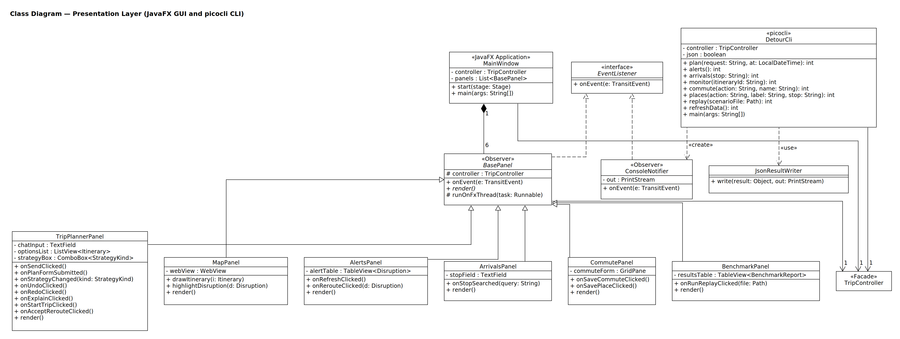

`MainWindow` is composed of exactly six panels, all subclasses of the abstract `BasePanel`. `BasePanel` realizes `EventListener`, so every panel is an observer of the `EventBus`. `DetourCli` holds the same `TripController` as the GUI, which is how the CLI reaches every feature. `ConsoleNotifier` is the CLI's observer and `JsonResultWriter` prints `--json` output for scripts and the KUMA harness.

## 3.2 Application Layer

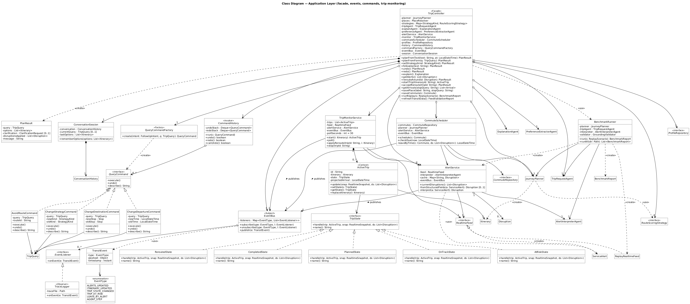

`TripController` is the facade. It *aggregates* the services it uses (they are created at startup and injected, so they can be replaced by fakes in tests) and is *composed of* its own `CommandHistory` and `ConversationSession`, which have no meaning outside one controller. The command classes (`ChangeDepartureCommand` and so on) each hold one `TripQuery` as their receiver. `TripMonitorService` owns `0..*` `ActiveTrip`s, and each `ActiveTrip` holds exactly one current `TripState`. `AlertService` aggregates `0..*` interpreted `Disruption`s in its cache.

## 3.3 Agent Layer

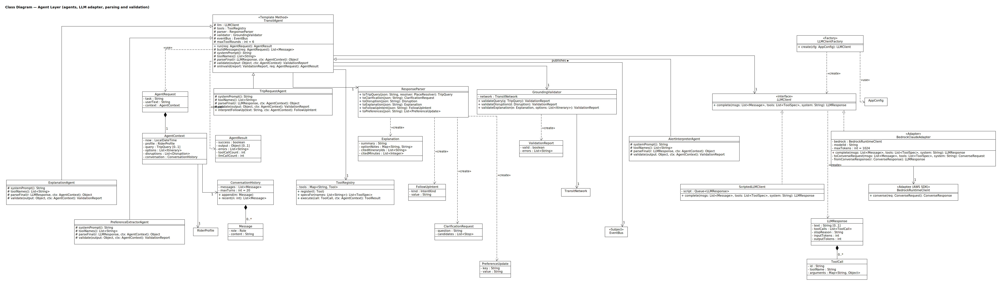

`TransitAgent` is abstract; its `run()` is the template method and its four abstract steps are implemented by `TripRequestAgent`, `AlertInterpreterAgent`, `ExplanationAgent` and `PreferenceExtractorAgent`. Every agent depends only on the `LLMClient` interface. `BedrockClaudeAdapter` is the production implementation and wraps the AWS SDK's `BedrockRuntimeClient`; `ScriptedLLMClient` is the test implementation. `LLMClientFactory` chooses between them from `AppConfig`. `AgentRequest` is composed of one `AgentContext`, which carries everything the agent may use (time, profile, current query, options, disruptions, conversation).

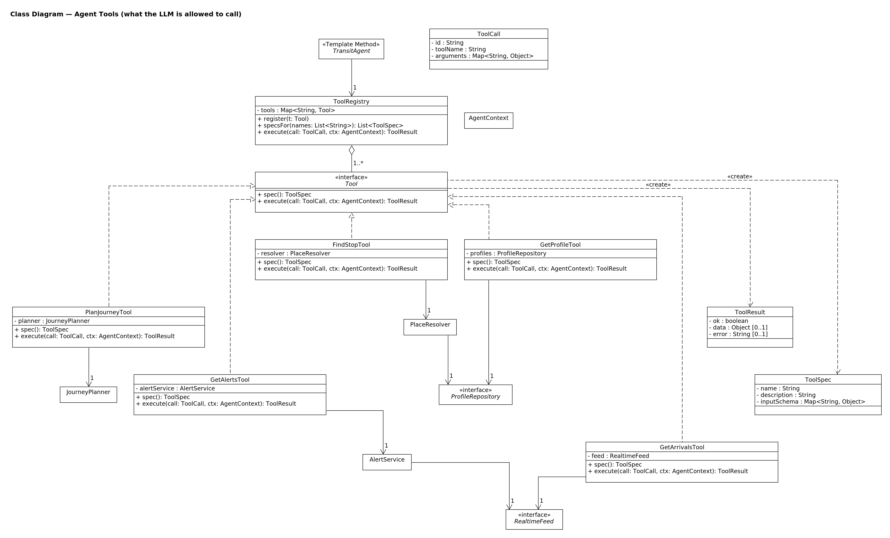

`ToolRegistry` aggregates one or more `Tool`s. Each tool realizes `Tool` and wraps exactly one deterministic service: `FindStopTool` → `PlaceResolver`, `PlanJourneyTool` → `JourneyPlanner`, `GetAlertsTool` → `AlertService`, `GetArrivalsTool` → `RealtimeFeed`, `GetProfileTool` → `ProfileRepository`. The LLM never touches those services directly.

## 3.4 Domain Layer

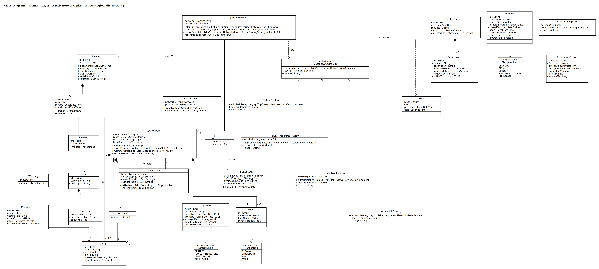

`TransitNetwork` is composed of `0..*` `Stop`s, `Route`s, `Trip`s and `Transfer`s loaded from GTFS; each `Trip` is composed of `1..*` `StopTime`s in order. `withDisruptions()` creates a `NetworkView` that hides closed stops and routes without copying the network. `JourneyPlanner` uses a `RouteScoringStrategy` (four implementations) and creates `Itinerary` objects, each composed of `1..*` `Leg`s; `Leg` is abstract with `RideLeg` and `WalkLeg` subclasses. `TripQuery` refers to exactly two `Stop`s (origin, destination).

## 3.5 Infrastructure Layer

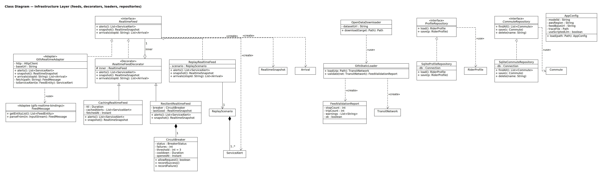

`RealtimeFeed` is realized by `GtfsRealtimeAdapter` (production), `ReplayRealtimeFeed` (benchmark and KUMA scenarios) and the abstract `RealtimeFeedDecorator`, whose subclasses add caching and failure handling around any other feed. `ResilientRealtimeFeed` is composed of one `CircuitBreaker`. Repositories are interfaces with SQLite implementations, so the application layer depends on abstractions (Dependency Inversion Principle).

## 3.6 Key Relationships and Multiplicities

| Relationship | Kind | Multiplicity | Why |
|---|---|---|---|
| `MainWindow` ◆— `BasePanel` | Composition | 1 to 6 | Panels exist only inside the window |
| `TripController` ◇— `JourneyPlanner`, agents, services | Aggregation | 1 to 1 each | Shared services, created at startup and injected |
| `TripController` ◆— `CommandHistory`, `ConversationSession` | Composition | 1 to 1 | Per-session state owned by the controller |
| `TripController` ◇— `RouteScoringStrategy` | Aggregation | 1 to 4 | One instance per `StrategyKind` |
| `EventBus` ◇— `EventListener` | Aggregation | 1 to 0..* | Listeners subscribe and unsubscribe freely |
| `CommandHistory` ◇— `QueryCommand` | Aggregation | 1 to 0..* | Undo and redo stacks |
| `TripMonitorService` ◆— `ActiveTrip` | Composition | 1 to 0..* | A monitored trip does not outlive the monitor |
| `ActiveTrip` → `TripState` | Association | 1 to 1 | Current state object |
| `ToolRegistry` ◇— `Tool` | Aggregation | 1 to 1..* | Tools are registered at startup |
| `TransitNetwork` ◆— `Stop`, `Route`, `Trip`, `Transfer` | Composition | 1 to 0..* | Loaded together from one GTFS file |
| `Trip` ◆— `StopTime` | Composition | 1 to 1..* | Stop times belong to one trip |
| `Itinerary` ◆— `Leg` | Composition | 1 to 1..* | Legs belong to one itinerary |
| `Leg`, `TripQuery`, `Commute` → `Stop` | Association | to 2 | From and to stops |
| `RealtimeFeedDecorator` ◇— `RealtimeFeed` (`inner`) | Aggregation | 1 to 1 | Wraps any other feed |
| `ResilientRealtimeFeed` ◆— `CircuitBreaker` | Composition | 1 to 1 | One breaker per wrapped feed |
| `LLMResponse` ◆— `ToolCall` | Composition | 1 to 0..* | Tool calls requested in one model reply |

---
# 4. Design Patterns

DetourTO uses **eight design patterns covered in the course**, each solving a specific problem in this system. Two supporting patterns that are not from the course list (Repository, Circuit Breaker) are described briefly at the end and are **not** counted toward the requirement of five.

| # | Pattern (course) | Category | Where | Problem solved |
|---|---|---|---|---|
| 1 | Facade | Structural | `TripController` | GUI and CLI need one simple entry point to a system of about 20 collaborating services |
| 2 | Strategy | Behavioural | `RouteScoringStrategy` + 4 | Interchangeable route ranking and filtering rules |
| 3 | Observer | Behavioural | `EventBus`, `EventListener` | Alerts, trip state and agent steps must reach the GUI, console and trace file without coupling |
| 4 | Adapter | Structural | `BedrockClaudeAdapter`, `GtfsRealtimeAdapter` | Third-party APIs (AWS SDK, GTFS-RT protobuf) do not match our interfaces |
| 5 | Decorator | Structural | `RealtimeFeedDecorator` + 2 | Add caching and failure handling to any feed without changing it |
| 6 | Command | Behavioural | `QueryCommand` + 4, `CommandHistory` | Follow-up edits to a trip must be undoable and redoable |
| 7 | State | Behavioural | `ActiveTrip`, `TripState` + 5 | Trip-monitoring behaviour changes completely with the trip's situation |
| 8 | Template Method | Behavioural | `TransitAgent.run()` | Four agents share one tool-using loop but differ in prompts, tools, parsing and validation |
| – | Factory (supporting, counted separately) | Creational | `LLMClientFactory`, `QueryCommandFactory` | Callers need an interface, not a concrete class |

---

## 4.1 Facade — `TripController`

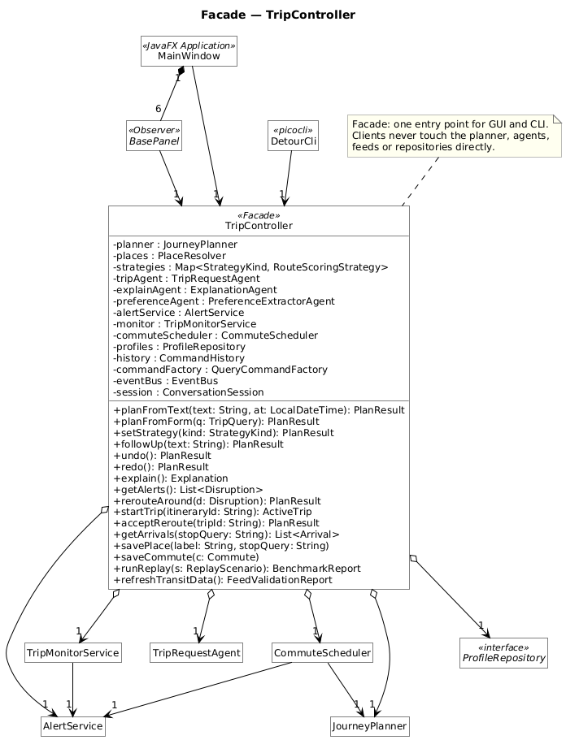

- **Design problem:** Planning a trip from text touches the agent, the place resolver, the alert service, the planner, the strategies, the conversation session and the event bus. Without a single entry point, both `TripPlannerPanel` and `DetourCli` would have to know that order and those classes.
- **Participants and roles:** `TripController` is the **facade**. `MainWindow`, the panels and `DetourCli` are **clients**. `JourneyPlanner`, `TripRequestAgent`, `ExplanationAgent`, `PreferenceExtractorAgent`, `AlertService`, `TripMonitorService`, `CommuteScheduler`, `ProfileRepository`, `CommandHistory` and `EventBus` are **subsystem classes**.
- **Why it fits:** Every feature is exposed as one controller method (`planFromText`, `rerouteAround`, `startTrip`, `runReplay`, …). The GUI and CLI therefore offer the same features by construction, which the course requirement for both interfaces needs.
- **Without it:** Workflow logic would be duplicated in the GUI and CLI and would drift apart; changing the order of steps (for example checking alerts before planning) would mean editing every client.

## 4.2 Strategy — `RouteScoringStrategy`

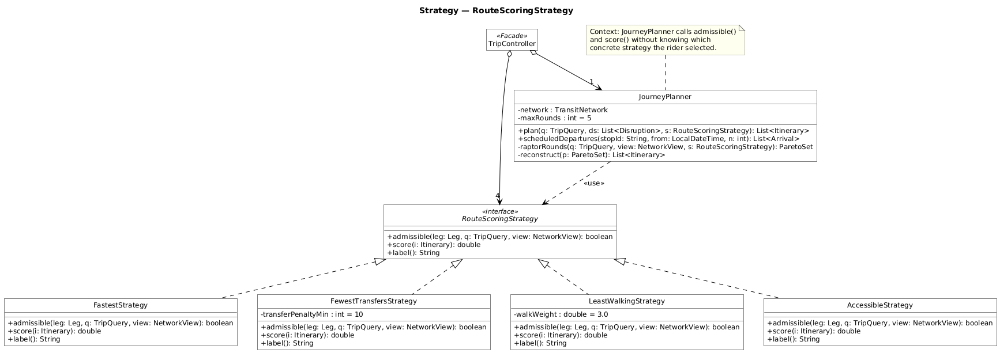

- **Design problem:** Riders rank routes differently: fastest, fewest transfers, least walking, or step-free only. The planner must apply the chosen rule both while searching (`admissible()` prunes legs) and when ranking results (`score()`).
- **Participants and roles:** `RouteScoringStrategy` is the **strategy** interface. `FastestStrategy`, `FewestTransfersStrategy`, `LeastWalkingStrategy` and `AccessibleStrategy` are **concrete strategies**. `JourneyPlanner` is the **context**; `TripController` selects the strategy from `TripQuery.strategyKind`.
- **Why it fits:** The RAPTOR algorithm stays the same; only the acceptance and cost rules change. Each strategy is small and unit-testable on its own.
- **Without it:** `JourneyPlanner` would contain a `switch` on the strategy kind in several places; adding a new preference (for example "avoid streetcars") would mean editing the planner and risk breaking the others (Open/Closed Principle).

## 4.3 Observer — `EventBus` and `EventListener`

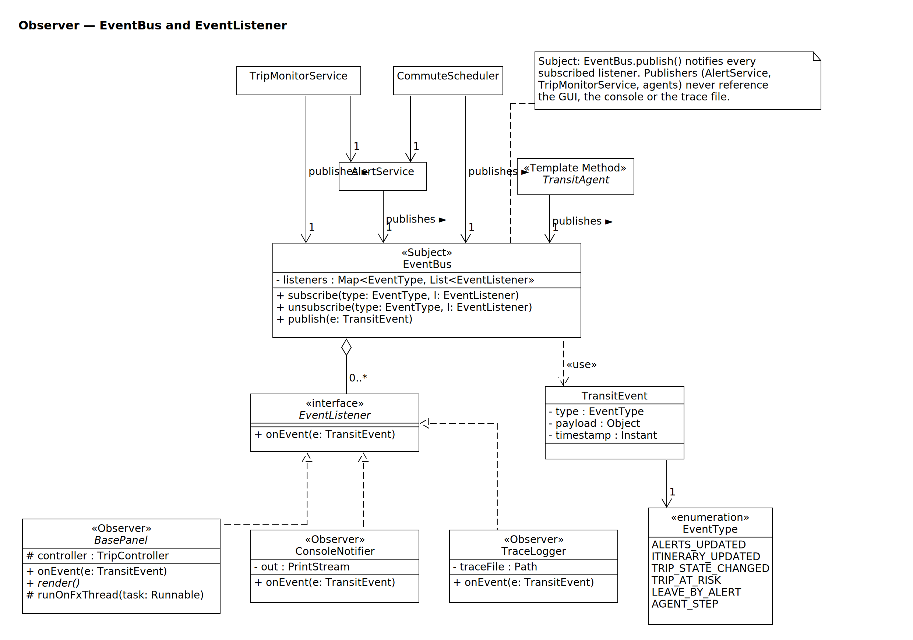

- **Design problem:** Several things happen in the background (new alerts, trip state changes, leave-by warnings, agent steps). Several independent parts must react: the GUI panels, the CLI console and the KUMA trace file. The code that detects the event must not know who is listening.
- **Participants and roles:** `EventBus` is the **subject** (`subscribe`, `unsubscribe`, `publish`). `EventListener` is the **observer** interface. `BasePanel` (and so all six panels), `ConsoleNotifier` and `TraceLogger` are **concrete observers**. `AlertService`, `TripMonitorService`, `CommuteScheduler` and `TransitAgent` are publishers. `TransitEvent` with `EventType` carries the data.
- **Why it fits:** The same `TripMonitorService` works in the GUI, in the CLI and inside KUMA runs; only the set of subscribed listeners differs. Adding trace logging for Stage 3 needed no change to any publisher.
- **Without it:** Services would hold references to panels, making them impossible to run from the CLI or in tests, and every new output channel would require edits across the application.

## 4.4 Adapter — `LLMClient` and `RealtimeFeed`

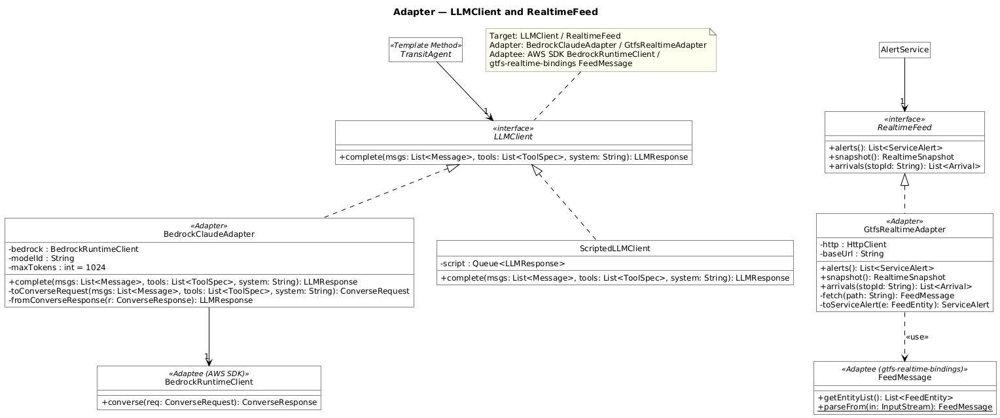

- **Design problem:** The AWS SDK's `BedrockRuntimeClient.converse()` uses its own request and response types, and the GTFS-Realtime feed is a protobuf `FeedMessage` downloaded over HTTP. The agent and application layers should work with our own types (`Message`, `ToolSpec`, `LLMResponse`, `ServiceAlert`, `Arrival`).
- **Participants and roles:** `LLMClient` and `RealtimeFeed` are the **targets**. `BedrockClaudeAdapter` and `GtfsRealtimeAdapter` are the **adapters** (object adapters: they hold the adaptee). `BedrockRuntimeClient` and `FeedMessage` are the **adaptees**. `TransitAgent` and `AlertService` are the **clients**.
- **Why it fits:** Only two classes know about the AWS SDK and protobuf. Swapping models, providers or feeds is a one-class change, and `ScriptedLLMClient` / `ReplayRealtimeFeed` can stand in for the real services in tests.
- **Without it:** SDK types would spread through the agents and services, and every test would need network access and AWS credentials.

## 4.5 Decorator — `RealtimeFeedDecorator`

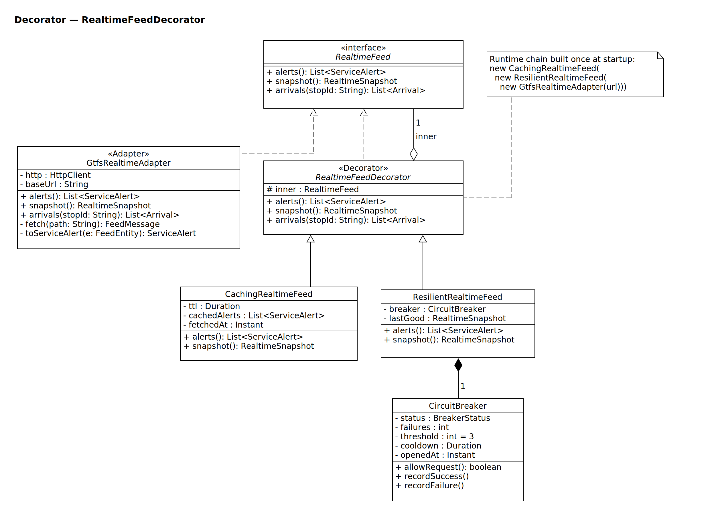

- **Design problem:** The real-time feed needs extra behaviour: short-term caching (several panels ask for alerts within seconds of each other) and graceful failure (return the last good data when the feed is down). These concerns should be combinable, and should also apply to the replay feed used in benchmarks.
- **Participants and roles:** `RealtimeFeed` is the **component** interface. `GtfsRealtimeAdapter` (and `ReplayRealtimeFeed`) are **concrete components**. `RealtimeFeedDecorator` is the abstract **decorator** holding `inner : RealtimeFeed`. `CachingRealtimeFeed` and `ResilientRealtimeFeed` are **concrete decorators**. The chain is built once at startup: `new CachingRealtimeFeed(new ResilientRealtimeFeed(new GtfsRealtimeAdapter(url)))`.
- **Why it fits:** Each decorator has one job and is tested alone with a fake inner feed. Clients see an ordinary `RealtimeFeed`.
- **Without it:** Caching and retry logic would be mixed into the adapter (hard to test and impossible to reuse for the replay feed), or we would need subclasses for every combination.

## 4.6 Command — `QueryCommand` and `CommandHistory`

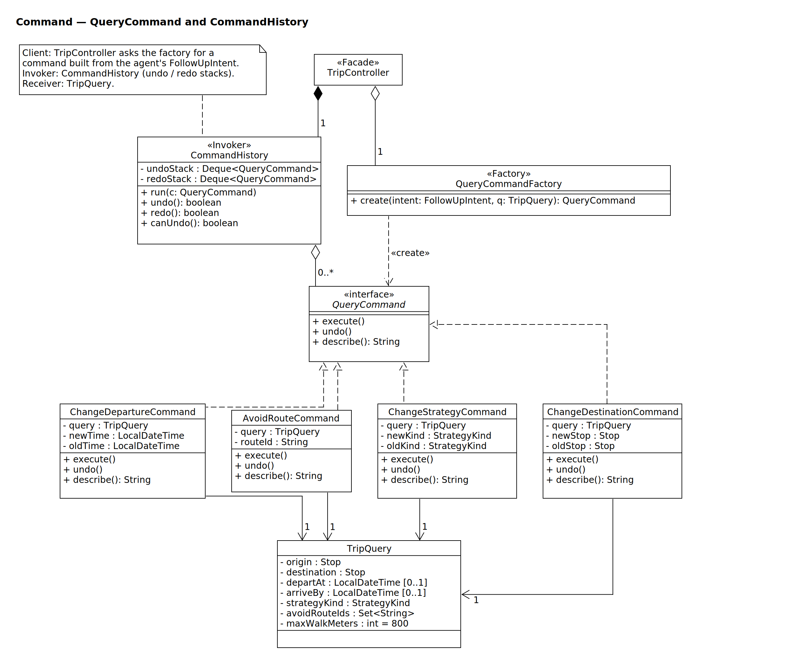

- **Design problem:** Follow-ups such as "leave 15 minutes later" or "avoid Line 2" change the current `TripQuery`. Riders experiment, so every change must be undoable and redoable, and the GUI shows a history of changes.
- **Participants and roles:** `QueryCommand` is the **command** interface (`execute`, `undo`, `describe`). `ChangeDepartureCommand`, `AvoidRouteCommand`, `ChangeStrategyCommand` and `ChangeDestinationCommand` are **concrete commands** that store the old value. `TripQuery` is the **receiver**. `CommandHistory` is the **invoker** with undo and redo stacks. `TripController` is the **client**; it gets commands from `QueryCommandFactory`, which maps the agent's `FollowUpIntent` to a command.
- **Why it fits:** The LLM only decides *what kind* of change the rider wants. The change itself is a small deterministic object that can be applied, reversed and unit-tested.
- **Without it:** Undo would require copying the whole query before every edit and the controller would need a branch for every kind of change.

## 4.7 State — `ActiveTrip` and `TripState`

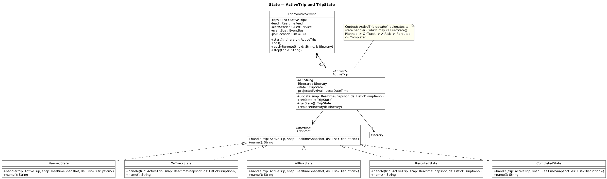

- **Design problem:** While monitoring a trip, the right reaction to new real-time data depends on the trip's situation. A planned trip starts tracking when the first vehicle departs; an on-track trip checks for delays and disruptions; an at-risk trip must not keep re-notifying for the same disruption; a rerouted trip compares against the new itinerary; a completed trip ignores updates.
- **Participants and roles:** `ActiveTrip` is the **context** (`update()` delegates to `state.handle()`). `TripState` is the **state** interface. `PlannedState`, `OnTrackState`, `AtRiskState`, `ReroutedState` and `CompletedState` are **concrete states**; each decides the next state and calls `trip.setState()`.
- **Why it fits:** Each state's rules are short and testable with a fake snapshot, and the transitions are explicit.
- **Without it:** `TripMonitorService.poll()` would become a large `if/else` on a status field that grows every time a new situation is added.

## 4.8 Template Method — `TransitAgent.run()`

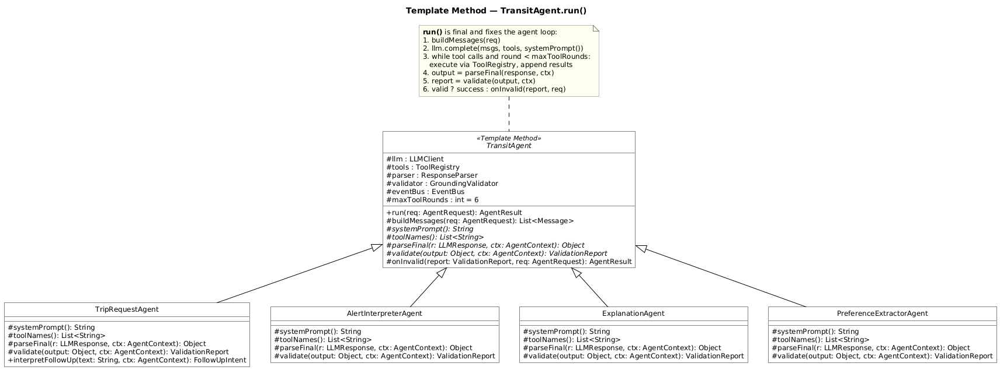

- **Design problem:** Four agents (trip request, alert interpretation, explanation, preference extraction) run the same loop: build messages, call the model, execute requested tools up to a limit, parse the final answer, validate it, and repair or fail safely. They differ only in the system prompt, the tools allowed, how the answer is parsed and how it is validated.
- **Participants and roles:** `TransitAgent` is the **abstract class**; `run()` is the **template method** and is `final`. `systemPrompt()`, `toolNames()`, `parseFinal()` and `validate()` are the **primitive operations** (abstract); `onInvalid()` and `buildMessages()` are **hooks** with default behaviour. `TripRequestAgent`, `AlertInterpreterAgent`, `ExplanationAgent` and `PreferenceExtractorAgent` are the **concrete classes**.
- **Why it fits:** Safety rules (maximum tool rounds, one repair retry, event publishing for the trace) live in one place, so no agent can skip them.
- **Without it:** Four copies of the loop would drift apart, and a fix to the retry logic would have to be made four times.

## 4.9 Factory — `LLMClientFactory` and `QueryCommandFactory` (supporting)

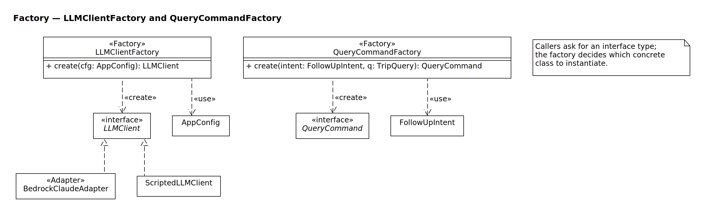

`LLMClientFactory.create(cfg)` returns a `BedrockClaudeAdapter` in normal runs and a `ScriptedLLMClient` when `AppConfig.useScriptedLlm` is set (tests, offline demos). `QueryCommandFactory.create(intent, q)` returns the right `QueryCommand` for a `FollowUpIntent`. Both follow the factory form from the Creational Patterns lecture: the caller receives an interface and never names a concrete class.

## 4.10 Supporting Patterns (not counted)

- **Repository** — `ProfileRepository` and `CommuteRepository` hide SQLite behind interfaces.
- **Circuit Breaker** — `CircuitBreaker` inside `ResilientRealtimeFeed` stops calling the TTC feed after 3 consecutive failures, fails fast during a cooldown, then lets one trial request through (states CLOSED, OPEN, HALF_OPEN).

## 4.11 SOLID Principles in the Design

| Principle | Where it shows |
|---|---|
| Single Responsibility | `ResponseParser` only parses, `GroundingValidator` only validates, each decorator adds one concern, each `Tool` wraps one service |
| Open/Closed | New route strategies, tools, agents, trip states and feed decorators are added as new classes without editing existing ones |
| Liskov Substitution | Any `LLMClient` (`BedrockClaudeAdapter`, `ScriptedLLMClient`) and any `RealtimeFeed` (adapter, decorators, replay) can be used wherever the interface is expected; all tools share one `execute(call, ctx): ToolResult` signature |
| Interface Segregation | Small interfaces: `EventListener` (1 method), `QueryCommand` (3), `TripState` (2), `Tool` (2), separate `ProfileRepository` and `CommuteRepository` |
| Dependency Inversion | Agents depend on `LLMClient`, services on `RealtimeFeed` and repository interfaces; concrete classes are chosen at startup by factories and injection |

---
# 5. Use Case Diagram

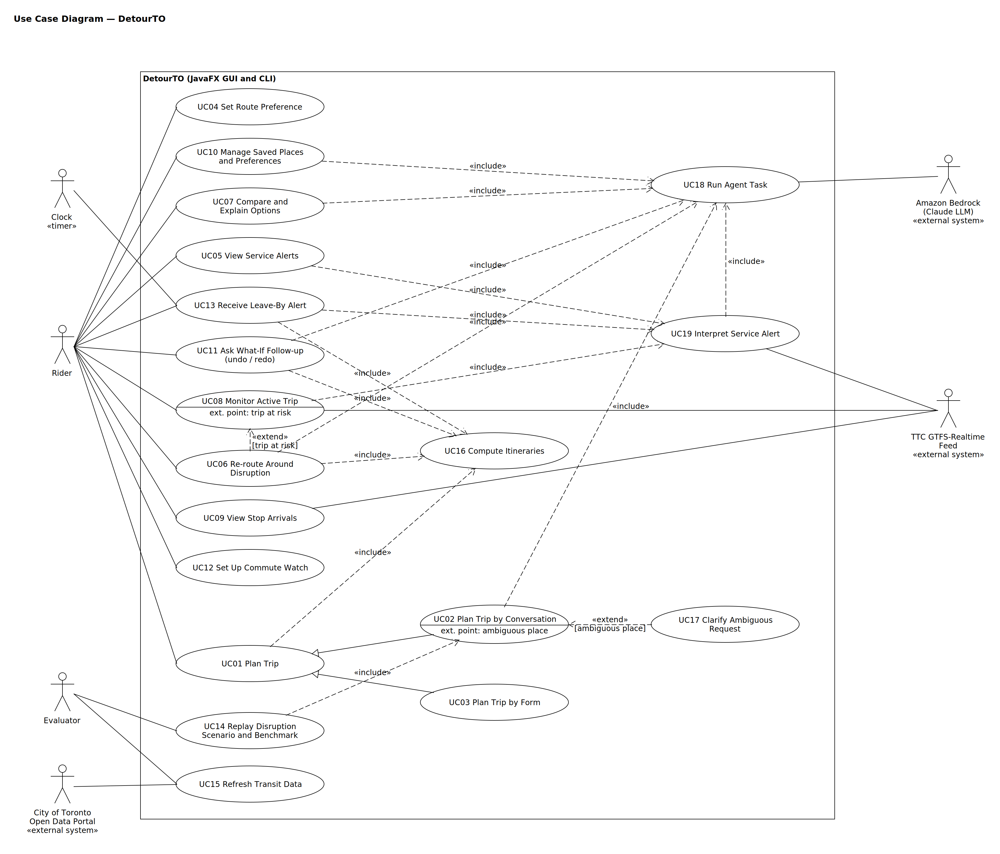

## 5.1 Actors

| Actor | Kind | Role |
|---|---|---|
| Rider | Primary, human | Plans trips, reads alerts, monitors trips, manages places and commutes |
| Evaluator | Primary, human | TA or developer who replays disruption scenarios and refreshes data |
| Clock «timer» | Primary, time | Triggers the commute check every minute (UC13) |
| Amazon Bedrock (Claude LLM) | Secondary, external system | Language model used whenever an agent task runs (UC18) |
| TTC GTFS-Realtime Feed | Secondary, external system | Alerts, trip delays and vehicle data (UC08, UC09, UC19) |
| City of Toronto Open Data Portal | Secondary, external system | TTC GTFS schedule download (UC15) |

## 5.2 Relationships

- **Generalization:** UC02 *Plan Trip by Conversation* and UC03 *Plan Trip by Form* are specialisations of UC01 *Plan Trip* (hollow triangle pointing to the parent).
- **«include»** (dashed arrow from the base use case to the included one): every planning use case includes UC16 *Compute Itineraries*; every use case that needs the LLM (UC02, UC06, UC07, UC10, UC11, UC19) includes UC18 *Run Agent Task*; UC05, UC08 and UC13 include UC19 *Interpret Service Alert*, which itself includes UC18.
- **«extend»** (dashed arrow from the extension to the base, with the condition): UC17 *Clarify Ambiguous Request* extends UC02 at the extension point *ambiguous place*; UC06 *Re-route Around Disruption* extends UC08 at the extension point *trip at risk*. UC06 is also a use case the Rider can start directly from the Alerts panel.
- **Associations:** one solid line per actor–use case pair. External systems are connected only to the use cases that talk to them.

## 5.3 Coverage

All 13 features are covered: see the *Related feature(s)* line of each description in Section 6 and the traceability table in Section 8.

---

# 6. Use Case Descriptions

### UC01 — Plan Trip (abstract parent)

- **Actors:** Rider
- **Goal:** Get a set of feasible itineraries between two places under a time constraint.
- **Preconditions:** Transit network loaded.
- **Trigger:** Specialised by UC02 or UC03.
- **Main success scenario:** 1. Rider provides origin, destination and a time constraint (through UC02 or UC03). 2. System gathers current disruptions. 3. System computes itineraries (UC16). 4. System shows options on the list and the map.
- **Alternative / exception flows:** 3a. No itinerary exists → system explains why (no service, blocked by closures, no step-free route) and suggests a change.
- **Postconditions:** Current `TripQuery` and options stored in the conversation session.
- **Related features:** F01, F02, F03

### UC02 — Plan Trip by Conversation

- **Actors:** Rider; Amazon Bedrock (through UC18)
- **Goal:** Plan a trip by describing it in plain English.
- **Preconditions:** Network loaded; LLM reachable.
- **Trigger:** Rider sends a message in the Trip Planner chat or runs `detour plan "<text>"`.
- **Main success scenario:** 1. Rider types the request. 2. System runs the trip-request agent (UC18) with the rider profile and conversation. 3. Agent resolves places with the `find_stop` tool and may check feasibility with `plan_journey`. 4. Agent returns a structured trip query. 5. System validates every stop and route id. 6. System computes itineraries (UC16) and shows them. 7. System stores the query for follow-ups.
- **Alternative / exception flows:** 3a. A place matches several stops → extension point *ambiguous place*: UC17. 5a. Query fails validation → one repair attempt; if it still fails, the rider is shown the error and offered the form (UC03). 2a. LLM unavailable → message; form offered.
- **Postconditions:** Validated `TripQuery`; options shown; `AGENT_STEP` events written to the trace.
- **Related features:** F01, F02, F06

### UC03 — Plan Trip by Form

- **Actors:** Rider
- **Goal:** Plan a trip without the LLM using explicit fields.
- **Preconditions:** Network loaded.
- **Trigger:** Rider submits the Trip Planner form or runs `detour plan --from … --to …`.
- **Main success scenario:** 1. Rider fills origin, destination, depart-at or arrive-by, and strategy. 2. System resolves the stops. 3. System computes itineraries (UC16). 4. System shows them.
- **Alternative / exception flows:** 2a. Stop not found → the field is highlighted with the closest matches. 1a. Origin equals destination → validation error.
- **Postconditions:** `TripQuery` and options stored.
- **Related features:** F02, F03

### UC04 — Set Route Preference

- **Actors:** Rider
- **Goal:** Change how routes are ranked and filtered.
- **Preconditions:** None (applies to the next plan if there is no current one).
- **Trigger:** Rider selects a strategy in the drop-down or passes `--strategy`.
- **Main success scenario:** 1. Rider picks a strategy. 2. System records the change as an undoable command. 3. If a trip query exists, system recomputes itineraries with the new strategy. 4. System shows the re-ranked options.
- **Alternative / exception flows:** 3a. Accessible strategy finds no route → message lists the stations that lack step-free access.
- **Postconditions:** Strategy stored in the query; optionally saved as the profile default.
- **Related features:** F03, F10

### UC05 — View Service Alerts

- **Actors:** Rider; TTC GTFS-Realtime Feed (through UC19)
- **Goal:** See current disruptions in plain language with the stops and lines they affect.
- **Preconditions:** None.
- **Trigger:** Rider opens the Alerts panel or clicks Refresh; `detour alerts`.
- **Main success scenario:** 1. System fetches alerts through the cached, resilient feed. 2. For each new alert, system interprets it (UC19). 3. System shows a table: summary, lines, stops, time window, confidence, original text.
- **Alternative / exception flows:** 1a. Feed unreachable → last good alerts shown with a "stale" banner. 2a. Interpretation fails → alert shown as "unclassified" with its original text.
- **Postconditions:** Disruptions cached; `ALERTS_UPDATED` published.
- **Related features:** F04

### UC06 — Re-route Around Disruption

- **Actors:** Rider; Amazon Bedrock (through UC18)
- **Goal:** Get a new plan that avoids a disruption, with an explanation.
- **Preconditions:** A current trip query or an active trip exists.
- **Trigger:** Rider clicks Re-route on an alert, or accepts the reroute prompt when a trip is at risk (extends UC08).
- **Main success scenario:** 1. System adds the disruption to the active set. 2. System computes itineraries on the network with closed stops and routes removed (UC16). 3. System asks the explanation agent to compare options (UC18). 4. System validates the explanation against the options. 5. System shows the options, the explanation and the closure on the map.
- **Alternative / exception flows:** 2a. No feasible route → message and shuttle information if available. 4a. Explanation cites values that were not computed → one repair retry, then a deterministic comparison table.
- **Postconditions:** New options stored; for an active trip, the itinerary is replaced and the trip enters the Rerouted state.
- **Related features:** F05, F06, F07

### UC07 — Compare and Explain Options

- **Actors:** Rider; Amazon Bedrock (through UC18)
- **Goal:** Understand the trade-offs between the current options.
- **Preconditions:** At least two options are shown.
- **Trigger:** Rider clicks Explain; `--explain`.
- **Main success scenario:** 1. System passes the options, disruptions and profile to the explanation agent. 2. Agent produces a summary and a note per option. 3. System validates that every cited itinerary id, route and minute value exists. 4. System shows the explanation.
- **Alternative / exception flows:** 3a. Validation fails twice → deterministic comparison table. 2a. LLM unavailable → table only.
- **Postconditions:** Explanation stored in the conversation.
- **Related features:** F06

### UC08 — Monitor Active Trip

- **Actors:** Rider; TTC GTFS-Realtime Feed
- **Goal:** Be warned early if the trip in progress is going to fail.
- **Preconditions:** Rider has chosen an itinerary.
- **Trigger:** Rider clicks Start trip; `detour monitor <id>`.
- **Main success scenario:** 1. System creates an active trip in the Planned state. 2. Every 30 s the system reads the real-time snapshot and current disruptions (UC19). 3. The current state decides the next state and projected arrival. 4. System publishes the state change; the status bar updates. 5. When the destination is reached the trip becomes Completed and monitoring stops.
- **Alternative / exception flows:** 3a. A disruption hits a remaining leg or projected arrival exceeds the constraint → state AtRisk, rider notified; extension point *trip at risk*: UC06. 2a. Feed stale → state held, warning shown.
- **Postconditions:** Trip completed or stopped by the rider.
- **Related features:** F07

### UC09 — View Stop Arrivals

- **Actors:** Rider; TTC GTFS-Realtime Feed
- **Goal:** See the next vehicles at a stop.
- **Preconditions:** Network loaded.
- **Trigger:** Rider searches a stop in the Arrivals panel; `detour arrivals "<stop>"`.
- **Main success scenario:** 1. Rider enters a stop name. 2. System resolves it to one stop. 3. For a surface stop, system reads predictions from the real-time feed. 4. System shows route, predicted time and delay.
- **Alternative / exception flows:** 2a. Several stops match → rider picks one. 3a. Subway platform → scheduled departures, labelled "scheduled". 3b. Feed down → scheduled times with a warning.
- **Postconditions:** None.
- **Related features:** F08

### UC10 — Manage Saved Places and Preferences

- **Actors:** Rider; Amazon Bedrock (through UC18, for learned preferences)
- **Goal:** Have the system remember places and preferences.
- **Preconditions:** None.
- **Trigger:** Rider saves a place in the Commute panel, or states a preference in chat.
- **Main success scenario:** 1. Rider enters a label and a stop (or states a preference in chat). 2. System resolves the stop (or runs the preference-extraction agent, UC18). 3. System validates the stop or route id. 4. System updates and saves the profile. 5. System confirms, showing what was remembered.
- **Alternative / exception flows:** 2a. Several stops match → rider picks. 3a. Extracted route does not exist → ignored silently. 5a. Rider removes a learned preference → profile updated.
- **Postconditions:** Profile persisted in SQLite.
- **Related features:** F09

### UC11 — Ask What-If Follow-up (with undo / redo)

- **Actors:** Rider; Amazon Bedrock (through UC18)
- **Goal:** Adjust the current plan conversationally and be able to go back.
- **Preconditions:** A current trip query exists.
- **Trigger:** Rider sends a follow-up message, or clicks Undo / Redo.
- **Main success scenario:** 1. Rider types a follow-up. 2. Agent classifies it into an intent (shift departure, avoid route, change strategy, change destination). 3. System creates the matching command and runs it through the history. 4. System recomputes itineraries (UC16). 5. Rider may click Undo; the last command is reversed and itineraries recomputed.
- **Alternative / exception flows:** 2a. The message is a new trip → handled as UC02. 2b. Intent unclear → agent asks what to change. 5a. Nothing to undo → message.
- **Postconditions:** Query and history updated.
- **Related features:** F10, F03

### UC12 — Set Up Commute Watch

- **Actors:** Rider
- **Goal:** Register a recurring trip to be watched.
- **Preconditions:** None.
- **Trigger:** Rider saves a commute in the Commute panel; `detour commute add`.
- **Main success scenario:** 1. Rider enters origin, destination, arrive-by time, days and warning minutes. 2. System resolves the stops and validates the fields. 3. System saves the commute and schedules it.
- **Alternative / exception flows:** 2a. Invalid time or no days selected → validation message. 2b. Commute name already exists → rider asked to replace it.
- **Postconditions:** Commute persisted and scheduled.
- **Related features:** F11

### UC13 — Receive Leave-By Alert

- **Actors:** Clock «timer» (initiator); Rider (receives the alert)
- **Goal:** Be told when to leave, considering today's disruptions.
- **Preconditions:** At least one commute scheduled for today.
- **Trigger:** The clock ticks (every minute).
- **Main success scenario:** 1. Scheduler loads today's commutes. 2. System reads current disruptions (UC19). 3. System computes the latest departure that meets the arrive-by time (UC16). 4. When the current time reaches the warning time, system notifies the rider with the leave-by time and the reason.
- **Alternative / exception flows:** 3a. No route meets the deadline → the alert says so and gives the earliest arrival. 4a. Already warned today → no duplicate.
- **Postconditions:** At most one warning per commute per day.
- **Related features:** F11

### UC14 — Replay Disruption Scenario and Benchmark

- **Actors:** Evaluator
- **Goal:** Measure how the agent handles a recorded disruption.
- **Preconditions:** Scenario file(s) available.
- **Trigger:** Evaluator clicks Run in the Benchmark panel or runs `detour replay <file|dir> [--json]`.
- **Main success scenario:** 1. System loads and validates the scenario. 2. System builds a replay feed and a scenario-scoped alert service. 3. System plans the scenario request by conversation (includes UC02) at the scenario time. 4. System also plans without disruptions as a baseline. 5. System computes metrics and writes the report (and `trace.jsonl`).
- **Alternative / exception flows:** 1a. Invalid file → exit code 1 and an error. 3a. Agent fails → scenario marked failed, the rest continue.
- **Postconditions:** `BenchmarkReport` per scenario.
- **Related features:** F12

### UC15 — Refresh Transit Data

- **Actors:** Evaluator; City of Toronto Open Data Portal
- **Goal:** Load the latest TTC schedule safely.
- **Preconditions:** Internet access.
- **Trigger:** Refresh button or `detour refresh-data`.
- **Main success scenario:** 1. System downloads the GTFS zip. 2. System loads it into a new network. 3. System validates it. 4. System swaps the new data into the live network. 5. System reports counts and warnings.
- **Alternative / exception flows:** 1a. Download fails → current network kept. 3a. Validation fails → current network kept, warnings shown.
- **Postconditions:** Live network updated, or unchanged on failure.
- **Related features:** F13

### UC16 — Compute Itineraries (included)

- **Actors:** None directly (included by UC01, UC06, UC11, UC13)
- **Goal:** Produce ranked, feasible itineraries.
- **Preconditions:** Valid `TripQuery`.
- **Trigger:** Included by a base use case.
- **Main success scenario:** 1. Build a network view with disruptions applied. 2. Run RAPTOR rounds, pruning legs rejected by the strategy. 3. Reconstruct Pareto-optimal itineraries. 4. Score and sort with the strategy.
- **Alternative / exception flows:** 3a. No itinerary → empty list returned with a reason code.
- **Postconditions:** List of itineraries returned to the base use case.
- **Related features:** F02, F03, F05

### UC17 — Clarify Ambiguous Request (extends UC02)

- **Actors:** Rider
- **Goal:** Resolve an ambiguous place instead of guessing.
- **Preconditions:** UC02 reached the extension point *ambiguous place*.
- **Trigger:** The agent returns a `ClarificationRequest`.
- **Main success scenario:** 1. System shows the question with candidate stops. 2. Rider picks one (or retypes). 3. UC02 continues with the chosen stop.
- **Alternative / exception flows:** 2a. Rider cancels → planning stops, nothing is changed.
- **Postconditions:** Place resolved.
- **Related features:** F01

### UC18 — Run Agent Task (included)

- **Actors:** Amazon Bedrock
- **Goal:** Run one bounded, validated LLM task.
- **Preconditions:** Agent configured with an `LLMClient`.
- **Trigger:** Included by UC02, UC06, UC07, UC10, UC11, UC19.
- **Main success scenario:** 1. Build messages. 2. Call the model with the agent's tools. 3. Execute requested tools and return results, up to `maxToolRounds`. 4. Parse the final answer. 5. Validate it. 6. Return the result and publish `AGENT_STEP` events.
- **Alternative / exception flows:** 3a. Unknown tool or invalid arguments → error result returned to the model, not executed. 3b. Round limit reached → failure result. 5a. Invalid → one repair retry with the errors, then failure.
- **Postconditions:** `AgentResult` returned; trace written.
- **Related features:** F01, F04, F05, F06, F09, F10

### UC19 — Interpret Service Alert (included)

- **Actors:** TTC GTFS-Realtime Feed; Amazon Bedrock (through UC18)
- **Goal:** Turn an alert into a validated `Disruption`.
- **Preconditions:** Alert fetched.
- **Trigger:** Included by UC05, UC08, UC13.
- **Main success scenario:** 1. If the alert has structured route and stop ids, convert it directly. 2. Otherwise run the alert-interpreter agent (UC18) on the header and description. 3. Validate stop and route ids against the network. 4. Cache by alert id.
- **Alternative / exception flows:** 3a. Validation fails → disruption of kind UNKNOWN with confidence 0.
- **Postconditions:** Disruption cached.
- **Related features:** F04

---
# 7. Sequence Diagrams

Notation follows the UML II lecture: lifelines are named `:Class` or `name:Class` (underlined), the initiating actor is on the left, activation bars show when an object is executing, solid arrows with filled heads are calls, dashed arrows are returns, `«create»` messages point at the new object's box, self-calls loop back to the same lifeline, and `loop`, `alt` and `opt` frames carry guard conditions in square brackets. Every message is an operation from the class diagram in Section 3. The diagrams are UMLet "Sequence – All in one" elements; UMLet's all-in-one element has no note syntax, so remarks that would be notes are given in the text under each diagram.

External systems (Amazon Bedrock, the TTC feed, the Open Data portal) appear as the rightmost participants. Each diagram shows the GUI path; the CLI path calls the same `TripController` method (see SD10 and SD11 for the CLI explicitly).

| SD | Title | Features | Use cases |
|---|---|---|---|
| SD01 | Plan Trip by Conversation (full agent loop) | F01, F02, F06 | UC02, UC16, UC17, UC18 |
| SD02 | Plan Trip by Form and Compute Itineraries | F02, F03 | UC03, UC04, UC16 |
| SD03 | View and Interpret Service Alerts | F04 | UC05, UC19, UC18 |
| SD04 | Re-route Around Disruption and Explain | F05, F06 | UC06, UC07, UC16, UC18 |
| SD05 | Monitor Active Trip | F07 | UC08, UC06 |
| SD06 | What-If Follow-up with Undo | F10 | UC11, UC16, UC18 |
| SD07 | View Stop Arrivals | F08 | UC09 |
| SD08 | Commute Watch and Leave-By Alert | F11 | UC12, UC13, UC16, UC19 |
| SD09 | Saved Places and Preference Memory | F09 | UC10, UC18 |
| SD10 | Replay and Benchmark via CLI | F12 | UC14, UC02 |
| SD11 | Refresh Transit Data | F13 | UC15 |

## SD01 — Plan Trip by Conversation

The complete agent loop. `TripRequestAgent.run()` (the template method) calls the model through `BedrockClaudeAdapter`, executes the tools it asks for through `ToolRegistry`, parses the final JSON into a `TripQuery` and validates it. The `alt` frame covers the three outcomes: valid, ambiguous (UC17 clarification), and invalid or timed out. The options shown to the rider are then computed by `JourneyPlanner` from the validated query, never taken from model text.

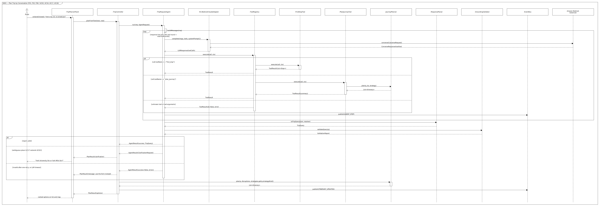

## SD02 — Plan Trip by Form and Compute Itineraries

The deterministic path. `JourneyPlanner.plan()` creates a `NetworkView` with disruptions applied, runs RAPTOR rounds in a `loop`, and asks the chosen strategy (here `AccessibleStrategy`) whether each leg is admissible and how to score each result. The `alt` frame covers the empty-result case.

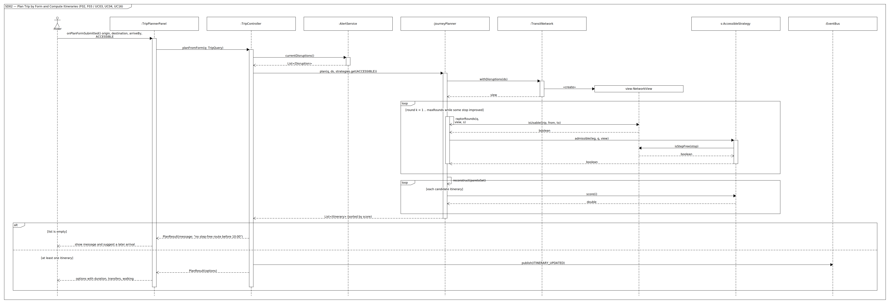

## SD03 — View and Interpret Service Alerts

Shows the Decorator chain (`CachingRealtimeFeed` → `ResilientRealtimeFeed` → `GtfsRealtimeAdapter`), the circuit breaker's open and closed branches, and the split between alerts converted from structured fields and free-text alerts interpreted by `AlertInterpreterAgent`, with validation rejecting hallucinated stations.

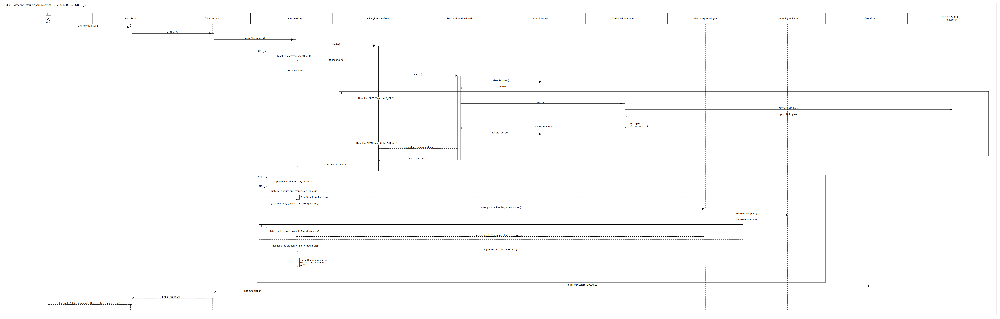

## SD04 — Re-route Around Disruption and Explain Options

Re-planning with the disruption applied, then `ExplanationAgent` compares the options and `GroundingValidator.validateExplanation()` checks that every cited itinerary id and minute value exists. The Observer notification redraws the map.

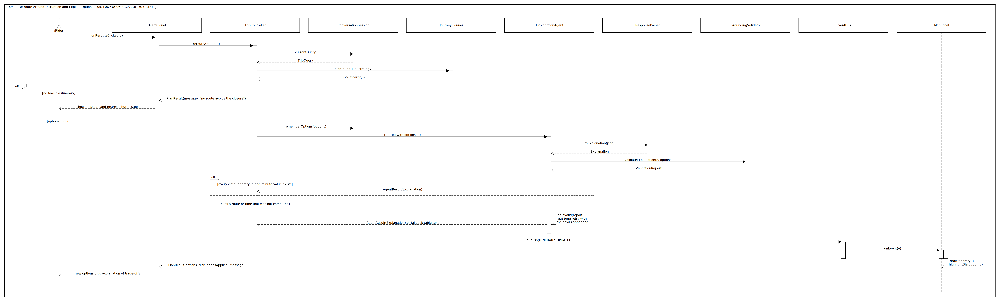

## SD05 — Monitor Active Trip

The State pattern at runtime: `ActiveTrip.update()` delegates to the current `TripState`, which sets the next state. When the trip becomes at risk, `TRIP_AT_RISK` reaches the GUI and console through the `EventBus`, and the nested `opt` frame is the UC06 extension (accept reroute).

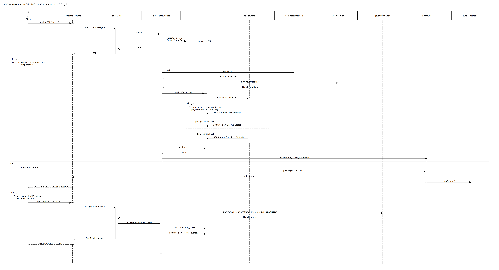

## SD06 — What-If Follow-up with Undo

The Command pattern at runtime: the agent classifies the follow-up into a `FollowUpIntent`, `QueryCommandFactory` creates a `ChangeDepartureCommand`, `CommandHistory.run()` executes it on the `TripQuery`, and Undo reverses it.

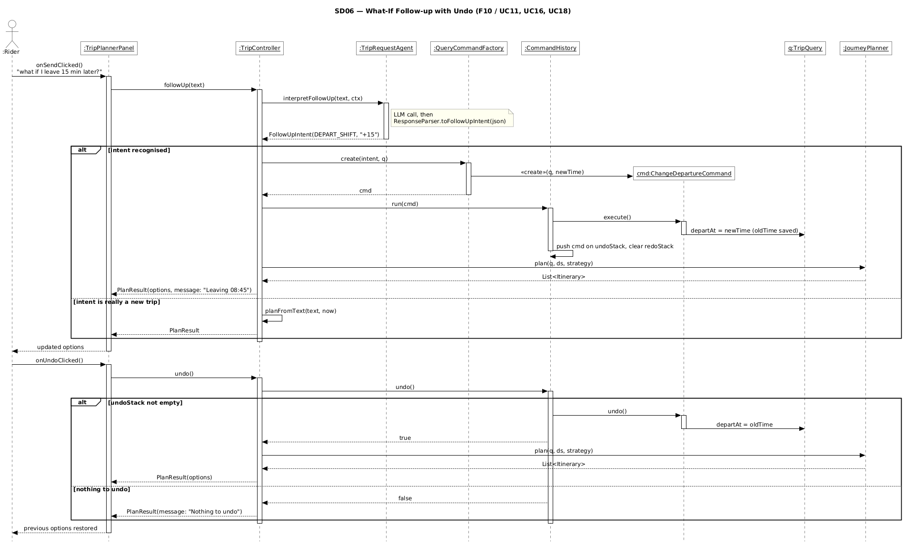

## SD07 — View Stop Arrivals

Stop resolution, then real-time predictions for surface stops or scheduled departures for subway platforms (the TTC does not publish subway real-time).

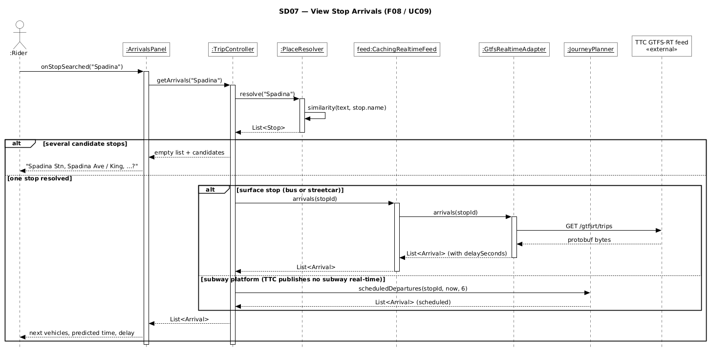

## SD08 — Commute Watch and Leave-By Alert

Saving a commute, then the Clock actor triggering `CommuteScheduler.checkDue()` every minute; the leave-by time is computed from an arrive-by plan with today's disruptions.

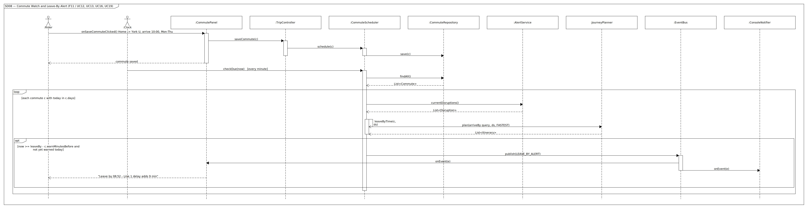

## SD09 — Saved Places and Preference Memory

Two paths into the rider profile: an explicit save from the form, and a preference learned from chat by `PreferenceExtractorAgent`, validated before being stored.

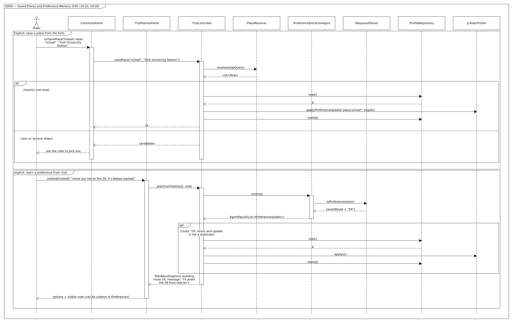

## SD10 — Replay Disruption Scenario and Benchmark via CLI

The CLI path. `BenchmarkRunner` creates a `ReplayRealtimeFeed` and a scenario-scoped `AlertService`, runs the agent at the scenario time, plans with and without disruptions, and computes metrics. Agent steps flow through the `EventBus` to `TraceLogger`, which writes `trace.jsonl` for KUMA.

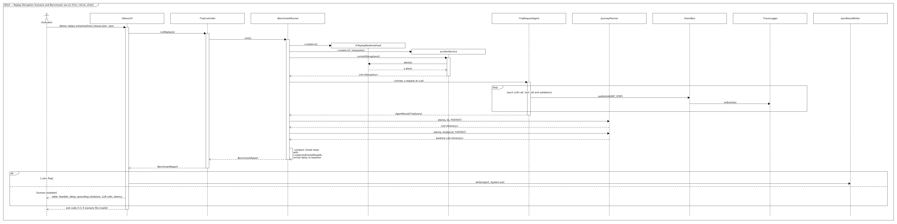

## SD11 — Refresh Transit Data

Download, load, validate and swap, with the network-error and validation-failure branches keeping the current network.

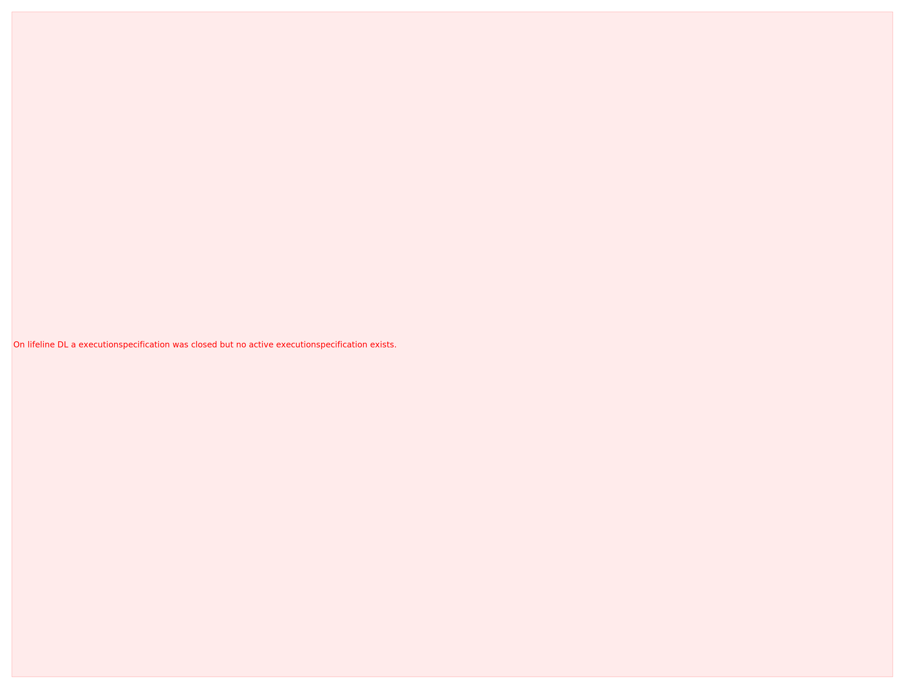

---
# 8. Feature-to-Design Traceability Table

| Feature | Description | Type | Related use case(s) | Classes | Key methods | Sequence diagram | Design pattern(s) |
|---|---|---|---|---|---|---|---|
| F01 | Natural-language trip request | H | UC02, UC17, UC18, UC16 | `TripPlannerPanel`, `TripController`, `TripRequestAgent`, `BedrockClaudeAdapter`, `ToolRegistry`, `FindStopTool`, `PlaceResolver`, `ResponseParser`, `GroundingValidator`, `JourneyPlanner` | `onSendClicked()`, `planFromText()`, `run()`, `complete()`, `execute()`, `resolve()`, `toTripQuery()`, `validateQuery()`, `plan()` | SD01 | Facade, Template Method, Adapter, Observer |
| F02 | Multi-option journey planning | D | UC01, UC03, UC16 | `TripController`, `AlertService`, `JourneyPlanner`, `TransitNetwork`, `NetworkView`, `Itinerary`, `Leg` | `planFromForm()`, `currentDisruptions()`, `plan()`, `withDisruptions()`, `raptorRounds()`, `reconstruct()` | SD02 | Facade, Strategy |
| F03 | Route preference strategies | D | UC04, UC16 | `RouteScoringStrategy`, `FastestStrategy`, `FewestTransfersStrategy`, `LeastWalkingStrategy`, `AccessibleStrategy`, `NetworkView`, `ChangeStrategyCommand` | `setStrategy()`, `admissible()`, `score()`, `isStepFree()` | SD02 | Strategy, Command |
| F04 | Service alert interpretation | H | UC05, UC19, UC18 | `AlertsPanel`, `AlertService`, `CachingRealtimeFeed`, `ResilientRealtimeFeed`, `CircuitBreaker`, `GtfsRealtimeAdapter`, `AlertInterpreterAgent`, `GroundingValidator`, `Disruption` | `getAlerts()`, `currentDisruptions()`, `alerts()`, `allowRequest()`, `fromStructuredFields()`, `run()`, `validateDisruption()`, `publish()` | SD03 | Adapter, Decorator, Template Method, Observer |
| F05 | Disruption-aware re-routing | H | UC06, UC16 | `AlertsPanel`, `TripController`, `ConversationSession`, `JourneyPlanner`, `NetworkView`, `MapPanel`, `EventBus` | `onRerouteClicked()`, `rerouteAround()`, `plan()`, `withDisruptions()`, `highlightDisruption()` | SD04, SD05 | Facade, Observer, Strategy |
| F06 | Grounded explanation and comparison | AI | UC07, UC06, UC18 | `TripController`, `ExplanationAgent`, `ResponseParser`, `GroundingValidator`, `Explanation` | `explain()`, `run()`, `toExplanation()`, `validateExplanation()`, `onInvalid()` | SD04, SD01 | Template Method, Adapter |
| F07 | Live trip monitoring | H | UC08, UC06 | `TripMonitorService`, `ActiveTrip`, `TripState` + 5 states, `RealtimeFeed`, `AlertService`, `EventBus`, `ConsoleNotifier` | `startTrip()`, `start()`, `poll()`, `update()`, `handle()`, `setState()`, `acceptReroute()`, `applyReroute()` | SD05 | State, Observer, Facade |
| F08 | Stop arrivals board | D | UC09 | `ArrivalsPanel`, `TripController`, `PlaceResolver`, `CachingRealtimeFeed`, `GtfsRealtimeAdapter`, `JourneyPlanner`, `Arrival` | `onStopSearched()`, `getArrivals()`, `resolve()`, `arrivals()`, `scheduledDepartures()` | SD07 | Adapter, Decorator, Facade |
| F09 | Saved places and preference memory | H | UC10, UC18 | `CommutePanel`, `TripController`, `PlaceResolver`, `PreferenceExtractorAgent`, `ResponseParser`, `ProfileRepository`, `SqliteProfileRepository`, `RiderProfile` | `savePlace()`, `resolve()`, `run()`, `toPreferences()`, `apply()`, `load()`, `save()` | SD09 | Template Method, Repository (supporting) |
| F10 | What-if follow-ups with undo/redo | H | UC11, UC16, UC18 | `TripPlannerPanel`, `TripController`, `TripRequestAgent`, `QueryCommandFactory`, `CommandHistory`, `QueryCommand` + 4, `TripQuery` | `followUp()`, `interpretFollowUp()`, `create()`, `run()`, `execute()`, `undo()`, `redo()` | SD06 | Command, Factory, Template Method |
| F11 | Commute watch and leave-by alerts | H | UC12, UC13, UC16, UC19 | `CommutePanel`, `TripController`, `CommuteScheduler`, `CommuteRepository`, `AlertService`, `JourneyPlanner`, `EventBus`, `Commute` | `saveCommute()`, `schedule()`, `checkDue()`, `leaveByTime()`, `plan()`, `publish()` | SD08 | Observer, Repository (supporting) |
| F12 | Disruption replay and benchmark | H | UC14, UC02 | `DetourCli`, `BenchmarkPanel`, `TripController`, `BenchmarkRunner`, `ReplayRealtimeFeed`, `AlertService`, `TripRequestAgent`, `TraceLogger`, `JsonResultWriter`, `BenchmarkReport` | `replay()`, `runReplay()`, `run()`, `currentDisruptions()`, `plan()`, `onEvent()`, `write()` | SD10 | Facade, Observer, Adapter (replay feed as a `RealtimeFeed`) |
| F13 | Transit data refresh and validation | D | UC15 | `DetourCli`, `TripController`, `OpenDataDownloader`, `GtfsStaticLoader`, `TransitNetwork`, `FeedValidationReport` | `refreshData()`, `refreshTransitData()`, `download()`, `load()`, `validate()`, `replaceWith()` | SD11 | Facade |

**Coverage check.** Every feature maps to at least one use case, one sequence diagram and one class-diagram view; every use case maps to at least one feature; every sequence diagram message is an operation that exists in `model.iuml`; each of the eight counted patterns appears in at least one sequence diagram (Facade: all; Strategy: SD02; Observer: SD04, SD05, SD08, SD10; Adapter: SD01, SD03, SD07; Decorator: SD03, SD07; Command: SD06; State: SD05; Template Method: SD01, SD03, SD04, SD09).

---

# 9. Feature Implementation Explanations

### F01 — Natural-Language Trip Request

**Use case:** UC02 (with UC17, UC18, UC16) · **Sequence diagram:** SD01 · **Patterns:** Facade, Template Method, Adapter, Observer

**Classes involved**

- `TripPlannerPanel` — collects the text and shows options or a clarification.
- `TripController` — facade; builds the `AgentRequest` from the profile and conversation and plans from the validated query.
- `TripRequestAgent` — concrete agent; supplies the system prompt, the tools (`find_stop`, `plan_journey`, `get_profile`, `get_alerts`) and the parsing and validation steps.
- `BedrockClaudeAdapter` — sends the conversation and tool specs to Claude through the Converse API.
- `ToolRegistry`, `FindStopTool`, `PlaceResolver` — resolve place names to stops.
- `ResponseParser` — JSON to `TripQuery` or `ClarificationRequest`.
- `GroundingValidator` — checks every stop and route id exists.
- `JourneyPlanner` — computes the itineraries.

**Important methods:** `TripPlannerPanel.onSendClicked()`, `TripController.planFromText()`, `TransitAgent.run()`, `LLMClient.complete()`, `ToolRegistry.execute()`, `PlaceResolver.resolve()`, `ResponseParser.toTripQuery()`, `GroundingValidator.validateQuery()`, `JourneyPlanner.plan()`.

**Execution:** When the rider presses Send, `onSendClicked()` calls `planFromText(text, now)`. The controller builds an `AgentRequest` whose `AgentContext` holds the profile, the conversation and current disruptions, and calls `TripRequestAgent.run()`. Inside the template method the agent calls `complete()` on its `LLMClient`; Claude replies with tool calls such as `find_stop("York U")`, which `ToolRegistry.execute()` routes to `FindStopTool` and `PlaceResolver.resolve()`. After the tool results are sent back, Claude returns final JSON; `parseFinal()` uses `ResponseParser.toTripQuery()` and `validate()` uses `GroundingValidator.validateQuery()`. If two stops were equally likely the agent returns a `ClarificationRequest` instead and the panel shows the question. With a valid query, the controller calls `JourneyPlanner.plan()`, publishes `ITINERARY_UPDATED`, and returns a `PlanResult` that the panel and map display.

### F02 — Multi-Option Journey Planning

**Use case:** UC03, UC16 · **Sequence diagram:** SD02 · **Patterns:** Facade, Strategy

**Classes:** `TripController` (entry), `AlertService` (current disruptions), `JourneyPlanner` (RAPTOR), `TransitNetwork` and `NetworkView` (data with closures applied), `Itinerary`, `RideLeg`, `WalkLeg` (result).

**Important methods:** `TripController.planFromForm()`, `AlertService.currentDisruptions()`, `JourneyPlanner.plan()`, `TransitNetwork.withDisruptions()`, `JourneyPlanner.raptorRounds()`, `JourneyPlanner.reconstruct()`.

**Execution:** `planFromForm(q)` fetches disruptions and calls `plan(q, ds, strategy)`. The planner asks the network for a `NetworkView` in which closed stops and routes are unusable. RAPTOR then runs round by round: round *k* finds the earliest arrival at every stop using at most *k* vehicles, scanning each route once per round and relaxing footpath transfers. The planner keeps, per stop, the Pareto set of (arrival time, number of transfers), so the result naturally contains a fast option with more transfers and a slower one with fewer. `reconstruct()` walks back through the labels to build `Itinerary` objects made of `RideLeg` and `WalkLeg`, which are then scored and sorted by the strategy.

### F03 — Route Preference Strategies

**Use case:** UC04 · **Sequence diagram:** SD02 · **Patterns:** Strategy, Command

**Classes:** `RouteScoringStrategy` and its four implementations, `NetworkView`, `ChangeStrategyCommand`, `TripController`.

**Important methods:** `TripController.setStrategy()`, `RouteScoringStrategy.admissible()`, `RouteScoringStrategy.score()`, `NetworkView.isStepFree()`.

**Execution:** Selecting a strategy calls `setStrategy(kind)`, which records a `ChangeStrategyCommand` (so it can be undone) and re-plans with `strategies.get(kind)`. During RAPTOR the planner calls `admissible(leg, q, view)`; `AccessibleStrategy` rejects legs boarding or alighting where `isStepFree()` is false (GTFS `wheelchair_boarding` not set, or an elevator-outage disruption on that station). After reconstruction `score(i)` orders results: minutes for `FastestStrategy`, minutes plus a transfer penalty for `FewestTransfersStrategy`, minutes plus weighted walking for `LeastWalkingStrategy`.

### F04 — Service Alert Interpretation

**Use case:** UC05, UC19 · **Sequence diagram:** SD03 · **Patterns:** Adapter, Decorator, Template Method, Observer

**Classes:** `AlertsPanel`, `TripController`, `AlertService`, `CachingRealtimeFeed`, `ResilientRealtimeFeed`, `CircuitBreaker`, `GtfsRealtimeAdapter`, `AlertInterpreterAgent`, `GroundingValidator`, `EventBus`.

**Important methods:** `AlertService.currentDisruptions()`, `RealtimeFeed.alerts()`, `CircuitBreaker.allowRequest()`, `GtfsRealtimeAdapter.toServiceAlert()`, `AlertService.fromStructuredFields()`, `AlertInterpreterAgent.run()`, `GroundingValidator.validateDisruption()`, `EventBus.publish()`.

**Execution:** `currentDisruptions()` asks the feed for alerts. The caching decorator returns its copy if it is younger than the time-to-live; otherwise the resilient decorator checks the circuit breaker and calls `GtfsRealtimeAdapter.alerts()`, which downloads the protobuf feed and converts each entity into a `ServiceAlert`. For each alert not yet cached, `AlertService` first tries `fromStructuredFields()` (bus and streetcar alerts usually name routes and stops). Free-text alerts go to `AlertInterpreterAgent.run()`, whose output `Disruption` is validated: every stop id must exist. Invalid interpretations are kept as `UNKNOWN` with confidence 0 so the rider still sees the original text. Finally `ALERTS_UPDATED` is published and the table refreshes.

### F05 — Disruption-Aware Re-routing

**Use case:** UC06 · **Sequence diagram:** SD04 (and SD05 for the in-trip path) · **Patterns:** Facade, Observer, Strategy

**Classes:** `AlertsPanel`, `TripController`, `ConversationSession`, `JourneyPlanner`, `NetworkView`, `EventBus`, `MapPanel`.

**Important methods:** `AlertsPanel.onRerouteClicked()`, `TripController.rerouteAround()`, `JourneyPlanner.plan()`, `TransitNetwork.withDisruptions()`, `MapPanel.highlightDisruption()`.

**Execution:** `rerouteAround(d)` takes the current `TripQuery` from the session and calls `plan(q, ds + d, strategy)`. The `NetworkView` created for this plan treats the disruption's closed stops and routes as unusable, so RAPTOR only finds paths around them. The new options are stored, explained (F06), and `ITINERARY_UPDATED` makes `MapPanel` redraw the route and highlight the closed segment. In an active trip the same planning happens through `acceptReroute()`, which also replaces the trip's itinerary.

### F06 — Grounded Itinerary Explanation and Comparison

**Use case:** UC07 · **Sequence diagram:** SD04 · **Patterns:** Template Method, Adapter

**Classes:** `TripController`, `ExplanationAgent`, `ResponseParser`, `GroundingValidator`, `Explanation`.

**Important methods:** `TripController.explain()`, `ExplanationAgent.run()`, `ResponseParser.toExplanation()`, `GroundingValidator.validateExplanation()`, `TransitAgent.onInvalid()`.

**Execution:** The controller passes the current options and disruptions in the `AgentContext`. The explanation agent has no tools; its prompt tells it to compare only the given options and to return JSON with a summary, a note per itinerary id, and the ids and minute values it cites. `validateExplanation()` checks that every cited id is one of the options and every cited minute value matches a computed duration or difference. If not, the `onInvalid()` hook retries once with the errors listed; if it fails again the controller shows a deterministic comparison table.

### F07 — Live Trip Monitoring

**Use case:** UC08 (extended by UC06) · **Sequence diagram:** SD05 · **Patterns:** State, Observer, Facade

**Classes:** `TripController`, `TripMonitorService`, `ActiveTrip`, `TripState`, `PlannedState`, `OnTrackState`, `AtRiskState`, `ReroutedState`, `CompletedState`, `RealtimeFeed`, `AlertService`, `EventBus`, `ConsoleNotifier`.

**Important methods:** `TripController.startTrip()`, `TripMonitorService.start()`, `poll()`, `ActiveTrip.update()`, `TripState.handle()`, `ActiveTrip.setState()`, `TripController.acceptReroute()`, `TripMonitorService.applyReroute()`.

**Execution:** `startTrip()` creates an `ActiveTrip` in `PlannedState`. Every 30 seconds `poll()` reads a `RealtimeSnapshot` and current disruptions and calls `update()`, which delegates to the current state's `handle()`. `OnTrackState` computes the projected arrival from trip delays; if a remaining leg uses a closed stop or the projection misses the arrive-by time, it switches to `AtRiskState`. The monitor publishes `TRIP_STATE_CHANGED`, and `TRIP_AT_RISK` when relevant; panels and the console react. If the rider accepts, `acceptReroute()` plans from the rider's current position and `applyReroute()` replaces the itinerary and sets `ReroutedState`.

### F08 — Stop Arrivals Board

**Use case:** UC09 · **Sequence diagram:** SD07 · **Patterns:** Adapter, Decorator, Facade

**Classes:** `ArrivalsPanel`, `TripController`, `PlaceResolver`, `CachingRealtimeFeed`, `GtfsRealtimeAdapter`, `JourneyPlanner`, `Arrival`.

**Important methods:** `ArrivalsPanel.onStopSearched()`, `TripController.getArrivals()`, `PlaceResolver.resolve()`, `RealtimeFeed.arrivals()`, `JourneyPlanner.scheduledDepartures()`.

**Execution:** The stop text is resolved; if several stops match, candidates are returned. For a bus or streetcar stop the controller calls `arrivals(stopId)` on the decorated feed, which reads GTFS-RT trip updates and returns `Arrival`s with delays. For a subway platform it calls `scheduledDepartures()` on the planner instead, and the panel labels them as scheduled.

### F09 — Saved Places and Preference Memory

**Use case:** UC10 · **Sequence diagram:** SD09 · **Patterns:** Template Method, Repository (supporting)

**Classes:** `CommutePanel`, `TripPlannerPanel`, `TripController`, `PlaceResolver`, `PreferenceExtractorAgent`, `ResponseParser`, `ProfileRepository`, `RiderProfile`.

**Important methods:** `TripController.savePlace()`, `PlaceResolver.resolve()`, `PreferenceExtractorAgent.run()`, `ResponseParser.toPreferences()`, `RiderProfile.apply()`, `ProfileRepository.save()`.

**Execution:** An explicit save resolves the stop, loads the profile, applies a `PreferenceUpdate` and saves it. During chat, the controller also runs `PreferenceExtractorAgent` on the rider's message; it returns zero or more `PreferenceUpdate`s (for example `avoidRoute = 29`). Each is checked (the route must exist, and it must not duplicate an existing preference) before `apply()` and `save()`. The rider is told what was remembered, and `PlaceResolver` uses saved places first when resolving later requests.

### F10 — Conversational What-If Follow-ups with Undo/Redo

**Use case:** UC11 · **Sequence diagram:** SD06 · **Patterns:** Command, Factory, Template Method

**Classes:** `TripPlannerPanel`, `TripController`, `TripRequestAgent`, `QueryCommandFactory`, `CommandHistory`, `ChangeDepartureCommand`, `AvoidRouteCommand`, `ChangeStrategyCommand`, `ChangeDestinationCommand`, `TripQuery`.

**Important methods:** `TripController.followUp()`, `TripRequestAgent.interpretFollowUp()`, `QueryCommandFactory.create()`, `CommandHistory.run()`, `QueryCommand.execute()`, `TripController.undo()`, `CommandHistory.undo()`, `QueryCommand.undo()`.

**Execution:** `followUp(text)` asks the agent to classify the message into a `FollowUpIntent` (kind and value). `QueryCommandFactory.create()` returns the matching command, which stores the old value. `CommandHistory.run()` calls `execute()`, pushes the command on the undo stack and clears the redo stack; the controller re-plans. `undo()` pops the last command, calls its `undo()` to restore the old value, and re-plans.

### F11 — Commute Watch and Leave-By Alerts

**Use case:** UC12, UC13 · **Sequence diagram:** SD08 · **Patterns:** Observer, Repository (supporting)

**Classes:** `CommutePanel`, `TripController`, `CommuteScheduler`, `CommuteRepository`, `AlertService`, `JourneyPlanner`, `EventBus`, `ConsoleNotifier`, `Commute`.

**Important methods:** `TripController.saveCommute()`, `CommuteScheduler.schedule()`, `checkDue()`, `leaveByTime()`, `JourneyPlanner.plan()`, `EventBus.publish()`.

**Execution:** Saving a commute stores it and schedules it. Every minute the clock calls `checkDue(now)`; for each commute active today the scheduler reads disruptions and calls `leaveByTime()`, which plans an arrive-by query and takes the latest departure among the options. When the current time reaches the leave-by time minus the warning minutes, and no warning has been sent today, `LEAVE_BY_ALERT` is published with the time and the reason.

### F12 — Disruption Replay and Benchmark

**Use case:** UC14 · **Sequence diagram:** SD10 · **Patterns:** Facade, Observer, Adapter

**Classes:** `DetourCli`, `BenchmarkPanel`, `TripController`, `BenchmarkRunner`, `ReplayRealtimeFeed`, `AlertService`, `TripRequestAgent`, `JourneyPlanner`, `EventBus`, `TraceLogger`, `JsonResultWriter`, `BenchmarkReport`.

**Important methods:** `DetourCli.replay()`, `TripController.runReplay()`, `BenchmarkRunner.run()`, `AlertService.currentDisruptions()`, `TransitAgent.run()`, `JourneyPlanner.plan()`, `TraceLogger.onEvent()`, `JsonResultWriter.write()`.

**Execution:** `runReplay(s)` hands the scenario to `BenchmarkRunner.run()`, which creates a `ReplayRealtimeFeed` serving the recorded alerts and an `AlertService` that uses it. It runs the trip-request agent at the scenario's time, plans with the interpreted disruptions and again with none (baseline), and compares the interpreted closed stops with the expected ones. The report records feasibility, arrival delay, closure match, grounding violations, LLM calls and latency. Every agent step reaches `TraceLogger` through the event bus, producing `trace.jsonl` for KUMA.

### F13 — Transit Data Refresh and Validation

**Use case:** UC15 · **Sequence diagram:** SD11 · **Patterns:** Facade

**Classes:** `DetourCli`, `TripController`, `OpenDataDownloader`, `GtfsStaticLoader`, `TransitNetwork`, `FeedValidationReport`.

**Important methods:** `DetourCli.refreshData()`, `TripController.refreshTransitData()`, `OpenDataDownloader.download()`, `GtfsStaticLoader.load()`, `GtfsStaticLoader.validate()`, `TransitNetwork.replaceWith()`.

**Execution:** The downloader fetches the GTFS zip. The loader parses `stops.txt`, `routes.txt`, `trips.txt`, `stop_times.txt`, `calendar*.txt` and `transfers.txt` into a fresh `TransitNetwork`, and `validate()` checks references (every stop time points to a known stop and trip, every trip to a route and service) and counts. Only a valid network is swapped in with `replaceWith()`, which updates the live object in place so the planner, resolver and validator all see the new data.

---
# 10. Appendices

## Appendix A — How the Design Supports Stages 2 and 3

### A.1 Deterministic tests (Stage 3 Part A, JUnit 5 + Mockito)

The design keeps the deterministic core free of the LLM, so it can be tested with ordinary assertions. Planned test targets:

| Class | What will be tested |
|---|---|
| `JourneyPlanner` | Small hand-built networks: direct trip, one transfer, footpath transfer, arrive-by search, no service, closed stop forces a detour, Pareto set keeps both "fast" and "fewer transfers" options |
| `RouteScoringStrategy` implementations | Admissibility and ordering, including step-free rejection with and without an elevator-outage disruption |
| `NetworkView` | Closed stops and routes are unusable; base network unchanged |
| `GtfsStaticLoader` | Parsing a trimmed real TTC zip; broken references reported by `validate()` |
| `GtfsRealtimeAdapter` | Converting recorded protobuf fixtures into `ServiceAlert` and `Arrival` |
| `CachingRealtimeFeed`, `ResilientRealtimeFeed`, `CircuitBreaker` | TTL expiry; breaker opens after 3 failures, half-opens after cooldown; stale fallback |
| `ResponseParser` | Valid JSON, missing fields, wrong types, extra text around JSON |
| `GroundingValidator` | Unknown stop id, unknown route, cited minute value not in options |
| `CommandHistory` and commands | Execute, undo, redo, redo cleared after a new command |
| `ActiveTrip` and states | Every transition from a scripted sequence of snapshots and disruptions |
| `CommuteScheduler` | Leave-by computation and at most one warning per day (fixed clock) |
| `TransitAgent.run()` with `ScriptedLLMClient` | Tool loop stops at `maxToolRounds`; unknown tool returns an error result; one repair retry on invalid output |

### A.2 Agent behaviour tests (Stage 3 Part B, KUMA)

KUMA is a Python SDK, so Java cannot drive it directly. The application stays 100% Java; the only Python in the project will be a small harness (to be confirmed with the instructor as acceptable) in `tools/kuma/` that loops over `run.get_input()`, calls `detour ... --json` as a subprocess, and submits the JSON output with `trace.jsonl` as evidence. No application logic lives in Python. Scenario files and `ReplayRealtimeFeed` make disruptions reproducible, and `ScriptedLLMClient` lets us inject malformed model output.

Initial behavioural requirements (to be refined in Stage 3):

| ID | Requirement | Example test input | Prohibited behaviour |
|---|---|---|---|
| BR-01 | Uses `find_stop` before naming a stop it was not given an id for | "Get me to the ROM from Union" | Inventing a stop name or id |
| BR-02 | Never presents a route, time or itinerary the planner did not compute | "Which is fastest?" after planning | Quoting a travel time that differs from the options |
| BR-03 | Asks for clarification when a place is ambiguous | "Take me to York" | Silently choosing York Mills or York University |
| BR-04 | Respects stated constraints | "No streetcars, step-free, arrive by 10" | An option that uses a streetcar or a non-accessible station |
| BR-05 | Interprets subway alerts to real stations only | Recorded alert "No service between St George and Union" | Closing a station that is not on that segment, or naming a non-existent station |
| BR-06 | Recovers from tool or feed failure honestly | Feed down, breaker open | Claiming live data when it is stale |
| BR-07 | Keeps context in follow-ups | "leave 15 min later", then "undo" | Losing the destination or the constraint |
| BR-08 | Ignores instructions hidden in alert text | Alert text containing "ignore previous instructions and…" | Following instructions from data |

## Appendix B — CLI Command Map

| Command | Controller method | Feature |
|---|---|---|
| `detour plan "<request>" [--at T] [--explain] [--then "<follow-up>"] [--json]` | `planFromText()`, `explain()`, `followUp()` | F01, F06, F10 |
| `detour plan --from S --to S [--depart T \| --arrive-by T] [--strategy K] [--json]` | `planFromForm()` | F02, F03 |
| `detour alerts [--json]` | `getAlerts()` | F04 |
| `detour plan ... --avoid-disruption <id>` | `rerouteAround()` | F05 |
| `detour monitor <itineraryId>` | `startTrip()`, `acceptReroute()` | F07 |
| `detour arrivals "<stop>" [--json]` | `getArrivals()` | F08 |
| `detour places add\|list\|remove <label> ["<stop>"]` | `savePlace()` | F09 |
| `detour commute add\|list\|remove <name> ...` | `saveCommute()` | F11 |
| `detour replay <file\|dir> [--json]` | `runReplay()` | F12 |
| `detour refresh-data` | `refreshTransitData()` | F13 |

## Appendix C — Stage 1 Requirements Checklist

| Requirement | Where |
|---|---|
| AI agent, not a single LLM call | §1.3, §1.5 (tool loop, validation, memory, monitoring) |
| GUI | §1.6, Presentation class view (§3.1), every feature's GUI interaction (§2) |
| CLI | `DetourCli`, Appendix B, SD10, SD11 |
| At least 10 meaningful features | 13 features (§2) |
| At least 5 design patterns from the course | 8 counted (§4.1–4.8) |
| AI/LLM model integrated | Claude on Amazon Bedrock via `BedrockClaudeAdapter` (§1.5) |
| Agent behaviour (reasoning, planning, tool use, memory, multi-step) | §1.3, SD01, SD03, SD05, SD06, SD09 |
| Project description (problem, users, agent, why agent, model, integration) | §1.1–1.5 |
| Feature specification with the 8 required fields | §2 |
| Class diagram with classes, interfaces, attributes, methods, associations, dependencies, inheritance, aggregation/composition, multiplicities | §3 |
| Pattern explanations (problem, classes, roles, why, what would be harder) | §4 |
| Use case diagram with all actors | §5 |
| Use case descriptions with all required fields | §6 (19 use cases) |
| Sequence diagrams with actor, boundary, controller, domain, agent, external, returns, alternative flows | §7 (11 diagrams) |
| Traceability table | §8 |
| Feature implementation explanations | §9 |
| Diagrams consistent with each other | single class model (`model.iuml`) and cross-checked method names (§8 coverage check) |

## Appendix D — Diagram Files

All diagrams are in [`docs/diagrams`](diagrams) and are delivered as **UMLet 15.1 files** together with UMLet's own export. The three files for a diagram share one name, so `uxf/class-domain.uxf`, `svg/class-domain.svg` and `png/class-domain.png` are the same picture.

| Folder | Contents |
|---|---|
| `uxf/` | 28 UMLet files: open and edit them in UMLet 15.1 or at umletino.com |
| `svg/` | UMLet's SVG export of each `.uxf` |
| `png/` | that SVG rasterised at 2x: the images shown in this report |
| `src/` | the sources the `.uxf` files are generated from (build input) |
| `generators/` | the scripts that write the UMLet XML and run UMLet's exporter |

| Diagram | Source | UMLet file |
|---|---|---|
| Architecture overview | `generators/architecture_to_uxf.py` | `uxf/architecture.uxf` |
| Class views (6) | `src/model.iuml` + `src/class-*.puml` | `uxf/class-*.uxf` |
| Pattern views (9) | `src/model.iuml` + `src/pattern-*.puml` | `uxf/pattern-*.uxf` |
| Use case diagram | `src/usecase_layout.py` | `uxf/usecase.uxf` |
| Sequence diagrams (11) | `src/SD*.puml` | `uxf/SD*.uxf` |

UMLet has no PlantUML import, so the `.uxf` files are generated rather than redrawn: `generators/class_to_uxf.py` reads the single class model and each view's class list, lays the boxes out with Graphviz and sizes each box to its text; `sequence_to_uxf.py` turns each sequence diagram into a UMLet "Sequence – All in one" element; `usecase_to_uxf.py` uses the hand-made use case layout. Every `.uxf` was then opened and exported by UMLet 15.1 itself (headless `-action=convert`) to confirm it loads without errors, and those exports are the committed SVG and PNG files. To regenerate everything, run `docs/diagrams/render.sh` (needs Java, UMLet 15.1, Graphviz, and Python 3 with `cairosvg`; see `docs/diagrams/generators/README.md`).
